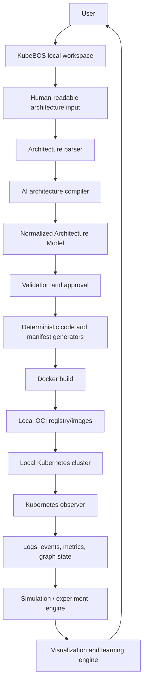
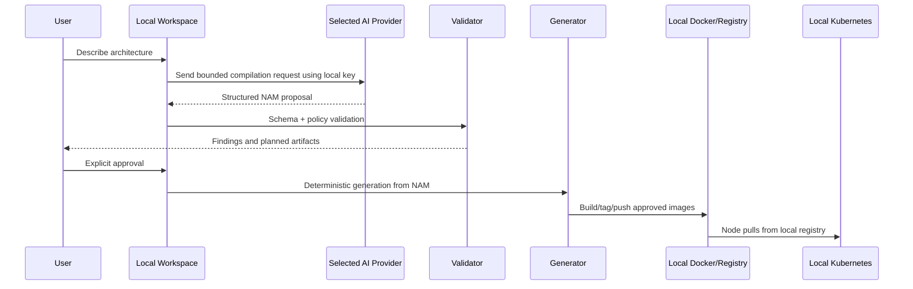
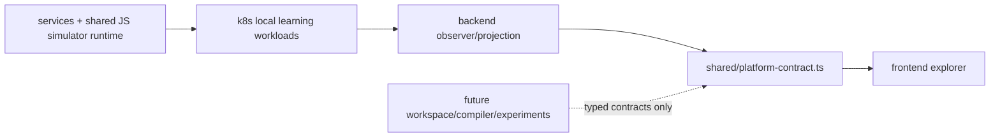

# KubeBOS Master Specification

**Status:** authoritative technical direction for KubeBOS.  
**Scope:** local-first Kubernetes and Docker learning workstation.  
**Normative language:** **CURRENT** describes repository behavior verified from source. **PLANNED** is an approved design direction that has not been implemented. **FUTURE** is intentionally deferred. A section marked PLANNED or FUTURE must not be represented in the UI or documentation as available functionality.

## 1. Project identity

KubeBOS is an open-source, local-first, interactive workstation for learning Docker, Kubernetes, distributed systems, observability, and production debugging through real local workloads and a real local Kubernetes cluster.

The existing repository still uses `local-microservice-simulator` and `@simulator/*` package names. These are current implementation names, not a claim that the product has already been renamed. KubeBOS is the product identity and the direction for future work.

KubeBOS is not a hosted SaaS dashboard, a managed Kubernetes service, or a replacement for production operations tooling. Its job is to make real local Kubernetes behavior observable, explainable, and safely experimentable.

## 2. Vision and problem statement

Kubernetes is difficult to learn because resource definitions, controller behavior, networking, scheduling, health checks, and events are usually separated across YAML, terminal commands, logs, and dashboards. KubeBOS will join those views without fabricating the cluster state:

1. A learner describes a small application in human-readable form.
2. KubeBOS eventually compiles that description into a validated, normalized architecture model.
3. Deterministic local generators produce inspectable source, Docker, and Kubernetes artifacts.
4. The learner builds and deploys to their own local environment.
5. KubeBOS observes the resulting resources, logs, events, metrics, traffic, and controller reactions.
6. Guided experiments explain what happened and why.

The current product slice is deliberately narrower: it is a read-only real-cluster explorer plus the existing simulator workloads.

## 3. Core philosophy and non-negotiable boundaries

### 3.1 Local-first

The user's machine owns source projects, architecture files, generated source code, generated manifests, Docker images, local registry contents, Kubernetes workloads, logs, simulation state, caches, and AI credentials. KubeBOS must remain useful without a KubeBOS-hosted backend.

No KubeBOS service is planned to remotely store a user's architecture, generated code, cluster state, logs, images, project history, or AI key.

### 3.2 Real state over simulated state

Kubernetes API list/watch results are the source of truth for Kubernetes resources. Kubernetes Events enrich explanation but are best-effort and short-lived. Metrics are sampled observations, not an event log. The UI may animate a resource transition after observing it, but may never invent Pods, scale actions, recovery outcomes, or network paths.

The existing Gateway/Validation/Security/OCR workload is intentionally simulated application logic. Its simulated latency/CPU/memory values are separate from real Kubernetes resource metrics and must always be labelled as simulated.

### 3.3 Explicit authority and safe local execution

Read-only observation and local artifact generation are distinct from cluster mutation. Future mutations must use narrow, validated, allowlisted APIs, explicit learner confirmation, namespace isolation, and observed Kubernetes outcomes. KubeBOS must never be an arbitrary shell or `kubectl` proxy.

### 3.4 Inspectability over magic

Generated source, Dockerfiles, Compose configuration, manifests, validation findings, and planned commands must be visible to the learner before execution. AI output supplies structured proposals; deterministic KubeBOS code generates executable artifacts.

## 4. Current implementation: verified inventory

### 4.1 Repository layout

```text
backend/                    TypeScript Fastify read-only Kubernetes observer/API
frontend/                   React + TypeScript + Vite + React Flow explorer
shared/                     Simulator runtime helpers and platform API contracts
services/                   Gateway, Validation, Security, OCR simulator services
infra/                      Local Nginx and MongoDB seed configuration
k8s/                        Local-registry-backed Kubernetes simulator manifests
scripts/                    Build/push/deploy/mirror scripts for the local workflow
docker-compose.yml          Local simulator Compose topology
docker-compose.registry.yml Local OCI registry topology
test/                       Node request-contract test
```

The root is an npm workspace. It includes `shared`, `services/*`, `backend`, and `frontend`. The root `npm run dev` starts the observer backend and Vite frontend together.

### 4.2 Existing simulator workloads — CURRENT

| Component | Current responsibility | Important boundary |
| --- | --- | --- |
| Nginx | Compose-only host entry point on `localhost:8080`; forwards to Gateway and propagates/generates `X-Request-Id`. | It is not currently deployed by the Kubernetes manifests. |
| Gateway API | `POST /api/process` validation, enabled-service selection, concurrent downstream calls, aggregate response. | Does not currently use MongoDB or Redis despite carrying their URLs in configuration. |
| Validation | Simulates checks and delay. | No real validation engine. |
| Security | Simulates standard/deep scan results and delay. | No scanner or third-party integration. |
| OCR | Simulates text/table/language extraction and delay. | No OCR or AI provider. |
| MongoDB | Compose sample-data container; Kubernetes `emptyDir` deployment. | Local only; no current application data path. |
| Redis | Compose append-only local container; Kubernetes deployment. | Local only; no current application cache path. |

All four Node services use shared helpers for environment configuration, JSON logging, in-memory bounded events, request metrics, `X-Request-Id` propagation, and common endpoints:

`GET /health`, `GET /live`, `GET /ready`, `GET /info`, `GET /metrics`, and `GET /events`.

Their events are process-local and intentionally disappear on restart. Metrics are process-local and simulated: request count, error count, active requests, average latency, simulated CPU percentage, and simulated memory. The shared request contract tests Gateway input validation with Node's built-in test runner.

### 4.3 Current Docker and Kubernetes workflow — CURRENT

Docker Compose runs the local simulator, Nginx, MongoDB, and Redis. It builds service images directly from their per-service Dockerfiles and does not require a registry.

A separate Compose file starts `registry:2` on port 5000. `scripts/build-and-push-images.sh` builds and pushes Gateway, Validation, Security, and OCR images to `localhost:5000/k8s-dockersimulator-<service>:latest`. `scripts/mirror-infrastructure-images.sh` mirrors MongoDB and Redis to the same local registry. `scripts/deploy-k8s.sh` applies `k8s/` and waits for the six Deployments.

The `k8s-simulator` namespace currently contains Deployment and Service manifests for Gateway, Validation, Security, OCR, MongoDB, and Redis. Application workloads use local registry images and readiness/liveness probes. There are no current Kubernetes manifests for Ingress, Nginx, HPA, ConfigMap, Secret, PVC, RBAC, metrics-server, or the platform backend.

The registry endpoint must be reachable from the Kubernetes node runtime. `localhost` in an image reference is evaluated by the node performing the pull, not automatically by the host Docker daemon.

### 4.4 Cluster observer backend — CURRENT

`backend/` is a Fastify TypeScript application. It loads the active default kubeconfig through `@kubernetes/client-node`, starts an initial list plus a resilient watch for each supported kind, relists after watch disconnect/error, and maintains an in-memory read model.

Watched kinds are:

- Namespaces, Nodes
- Deployments, ReplicaSets, DaemonSets, StatefulSets
- Pods, Services, Ingresses
- Jobs, CronJobs
- ConfigMaps, Secrets
- PersistentVolumes, PersistentVolumeClaims, StorageClasses
- Kubernetes Events

Pods are additionally projected into synthetic Container graph nodes from their container status. Containers are not independently watched Kubernetes resources.

The state cache stores normalized resources keyed by UID, raw Kubernetes objects for YAML detail, resource histories (up to 100 per UID), Kubernetes Events (up to 500 in snapshots), observer errors, and derived statistics. It applies an optional comma-separated `PLATFORM_NAMESPACES` filter; cluster-scoped Nodes, PersistentVolumes, and StorageClasses remain visible when filtering. The backend is read-only with one current exception in transport form: it proxies a selected Gateway Pod's `/events` endpoint at `/simulator/traffic`; it does not generate traffic or mutate anything.

Current APIs:

| API | Current behavior |
| --- | --- |
| `GET /health`, `/live` | Basic platform process probes. |
| `GET /ready` | `ready` or `degraded` based on observer errors; includes diagnostics. |
| `GET /diagnostics` | Watch connection/list/event/reconnect diagnostics. |
| `GET /snapshot` | Current normalized resource snapshot, events, statistics, and errors. |
| `GET /resources` | Optional `kind`, `namespace`, and `search` filtering. |
| `GET /resource/:kind/:namespace/:name` | Normalized resource, raw YAML, history, and correlated Events; cluster scope uses `cluster` or `_`. |
| `GET /timeline` | Merged Kubernetes Event and resource-change history; optional `limit` and `namespace`. |
| `GET /graph` | Derived graph; optional `namespace`. |
| `GET /metrics` | Derived resource statistics plus an unavailable metrics-provider response. |
| `GET /logs` | Bounded read of named Pod logs; requires namespace/name. |
| `GET /events` | Server-Sent Events: initial `snapshot`, incremental `cluster-update`, 15-second heartbeats. |
| `GET /simulator/traffic` | Best-effort proxy to an observable Gateway Pod's `/events`; no frontend consumer currently exists. |

The current graph builder derives `owns`, namespace `contains`, Pod `scheduled_on` Node, Pod volume `mounts`, Ingress `routes_to` Service, Service selector `selects` Pod, PVC/PV `bound_to`, PVC `uses` StorageClass, and Pod `runs` Container edges. It does not model Endpoints/EndpointSlices, CoreDNS, kube-proxy implementation details, NetworkPolicies, actual request traces, or routing decisions.

The metrics abstraction exists as `MetricsProvider`, but the only provider returns `available: false`; `metrics.k8s.io` is not integrated. WebSocket support is not implemented.

### 4.5 Frontend explorer — CURRENT

`frontend/` is React 19, TypeScript, Vite, and `@xyflow/react`. Vite proxies platform routes to `localhost:4000`. The app initially selects `k8s-simulator`, fetches `/snapshot` and namespace-filtered `/graph`, opens the SSE stream, refreshes graph data on `cluster-update`, and refits the graph without a browser reload.

The UI currently provides a React Flow canvas with custom typed/status-coloured resource nodes, pan/zoom, minimap, Fit/Reset controls, namespace selector, name/kind/namespace search, resource-kind filters, cluster counters, click selection, and a side panel. The inspector shows status, owner, age, labels, annotations, conditions, correlated events, Pod log polling, and collapsible raw YAML. A timeline shows a bounded list of snapshot Events. This is functional developer UI, not a finished visual design or teaching experience.

Known current frontend limits: layout is deterministic/simple rather than an auto-layout engine; graph filtering is client-side after graph retrieval; resource counters derive from the global snapshot rather than the selected graph; container detail is synthetic and has no raw Kubernetes object; the `/simulator/traffic` API is not rendered; no WebSocket or metrics charts exist.

## 5. Target conceptual system

The following is the authoritative long-term architecture. It describes component boundaries, not currently implemented modules.



The user owns all boxes except the optional authentication provider and the selected AI provider. The AI provider receives only the request necessary to compile an architecture; it is not the execution authority.

### Component responsibilities

| Component | Responsibility | Must not do |
| --- | --- | --- |
| Workspace | Local project discovery, metadata, paths, lifecycle. | Become a remote project store. |
| Architecture input/parser | Preserve human input and parse lightweight structure. | Treat prose as executable instructions. |
| AI architecture compiler | Produce a schema-constrained architecture proposal. | Directly run shell commands or freely author authoritative manifests. |
| Normalized Architecture Model (NAM) | Canonical representation for services, dependencies, protocols, state, ports, resources, and runtime configuration. | Depend on provider-specific AI wording. |
| Validation/approval | Schema, safety, policy, and deterministic validation; user confirmation. | Silently execute a generated plan. |
| Generators | Deterministically create source skeletons, Dockerfiles, Compose and Kubernetes artifacts from NAM. | Interpret arbitrary model output outside the NAM. |
| Build/registry adapter | Build/tag/push local OCI images and capture immutable metadata. | Assume Docker's host cache is a Kubernetes registry. |
| Deployment adapter | Apply validated, reviewable manifests to configured local target. | Expose arbitrary cluster-wide command execution. |
| Observer | Read current Kubernetes state, logs/events/metrics, and project stable contracts. | Claim an action succeeded before observation confirms it. |
| Experiment engine | Run allowlisted local experiments, track intent/state, and correlate observation. | Be a general fault-injection framework or remote operator. |
| Visualization | Render observed state and explicitly labelled derived explanations. | Invent topology or packet-level Kubernetes internals. |
| Learning engine | Deliver progressive concept, walkthrough, challenge, and explanation content. | Gate access to real observed state. |

## 6. Local-first data, cache, and identity model

### 6.1 Sources of truth

| Data | Source of truth | Cache / derived copies |
| --- | --- | --- |
| Architecture input and user-authored project files | Workspace files | Parsed/NAM cache may be rebuilt. |
| Generated source/manifests | User-approved workspace artifacts | Build metadata may be rebuilt. |
| Docker images | Local Docker/OCI engine and local registry | Image metadata index. |
| Live Kubernetes state | Kubernetes API | Observer in-memory cache; optional disposable local recovery cache. |
| Logs/Events/Metrics | Kubernetes/application APIs | Bounded local history only. |
| Experiment intent | Local workspace experiment record | In-memory active state. |
| AI key | OS credential store or equivalent local encrypted secret storage | Never cache plaintext. |

### 6.2 Local cache model — PLANNED

Use a platform-owned, user-local cache directory determined by the operating system (for example XDG cache on Linux, platform cache directories on macOS/Windows), never the project source tree by default. A conceptual layout is:

```text
<platform-cache>/kubebos/
  installations/<installation-id>/
    ai-response-cache/        Disposable, provider-keyed response metadata/content when enabled
    projects/<project-id>/
      normalized-model/       Rebuildable NAM snapshots and schema versions
      generated-metadata/     Artifact hashes, generator versions, build plans
      images/                 Local image/registry metadata, not image layers
      observer/               Optional bounded recovery snapshots/history
      experiments/            Temporary execution/checkpoint state
```

Cache entries need schema version, project ID, source input hash, generator/model version, timestamps, and expiry/purge semantics. Cache is disposable and must never be the source of truth. Deleting it must leave a project recoverable from workspace files, local image inspection, and fresh cluster observation.

### 6.3 Identity model — PLANNED

| Identity | Meaning | Storage/exposure |
| --- | --- | --- |
| Firebase UID | Authentication-provider identifier. | Internal only; never display as KubeBOS identity. |
| KubeBOS user identity | Local mapping to an authenticated account where needed. | Local metadata; may refer to Firebase UID internally. |
| Installation ID | UUIDv7 created once for a local KubeBOS installation. | Local configuration; suitable for display as `KubeBOS · <UUIDv7>`. |
| Project ID | UUIDv7 created in a project’s local metadata. | Local project metadata and cache keys. |
| Session ID | UUIDv7 per UI/experiment session. | Ephemeral local diagnostic/audit correlation. |
| Request/trace ID | Per application request. | Existing simulator uses `X-Request-Id`; future platform traces can correlate it. |

UUIDv7 is preferred for visible KubeBOS, installation, project, and session identifiers because it avoids showing raw Firebase UIDs and carries useful ordering properties. Identity must not imply that local project data is uploaded.

## 7. Authentication, AI providers, and credentials — PLANNED

Authentication is optional platform identity infrastructure, initially Firebase Authentication / Google login. Its allowed remote data is minimal: Firebase UID, account creation time, last login time, and authentication metadata needed by the provider. It must not become a remote datastore for projects, artifacts, cluster state, logs, history, or AI keys.

AI access is bring-your-own-key. Initial support is OpenRouter, but all use must pass through a local provider abstraction so future providers can include OpenAI, Anthropic, local Ollama, and OpenAI-compatible endpoints.

```ts
interface AiProvider {
  id: string;
  validateCredential(): Promise<void>;
  compileArchitecture(input: ArchitectureInput, options: CompileOptions): Promise<ArchitectureProposal>;
}
```

Credentials are entered locally and stored using appropriate OS credential storage or an equivalent encrypted local secret mechanism. They are injected only into the local provider adapter at request time, redacted from logs, excluded from project files and caches, and never sent to KubeBOS-owned infrastructure. Provider selection, model identifiers, and request retention behavior must be visible to the user.

## 8. Architecture input and the Normalized Architecture Model — PLANNED

Users initially provide Markdown, plain text, or a simple architecture description rather than Kubernetes YAML. For example:

```text
Frontend: Node.js, port 3000
Backend: Node.js, port 4000
Database: MongoDB, port 27017
Traffic: Frontend -> Backend; Backend -> MongoDB
```

The AI compiler turns this into a schema-valid architecture proposal. The NAM, not natural language and not freeform generated YAML, is the canonical representation. Deterministic KubeBOS generators consume the NAM.

At minimum, NAM must model:

- architecture/project identity and version;
- services, workloads, runtime/language templates, images, commands, and environment contracts;
- ports, protocols, ingress/public exposure, and service-to-service dependencies;
- traffic relationships and request semantics;
- stateful dependencies/databases, persistence, volumes, and data ownership;
- configuration and secret references (never raw secret values in a generated public spec);
- resource requests/limits, replicas, health probes, and scaling policy intent;
- Kubernetes placement policy intent such as namespace, affinity, tolerations, and service account;
- validation findings, generator provenance, and explicit approvals.

The model must have a versioned JSON schema and a deterministic migration policy. Generator output must include source NAM version and artifact hashes so an instructor or learner can trace why an artifact exists.

## 9. AI architecture compiler and execution safety — PLANNED



The AI has no direct execution authority. Before execution, future validation must include NAM schema validation, generated-code validation, Dockerfile policy validation, manifest schema/policy validation, dangerous-configuration detection, resource limits, and explicit user approval.

At minimum, dangerous configuration detection must reject or require a deliberate elevated confirmation for privileged containers, host PID/IPC/network, host filesystem mounts, dangerous capabilities, unrestricted host ports, unbounded resources, unknown image sources, and unsafe cluster-scoped resources. The exact policy belongs in versioned code/config, not prompt text.

## 10. Docker and Kubernetes integration — PLANNED direction

Generated applications should consist of independently deployable services with per-service Dockerfiles. Build artifacts should use immutable tags or digests whenever practical; mutable `latest` exists only in the current learning workflow.

The target path is:

```text
Approved NAM -> generated service -> Dockerfile -> docker build
             -> local OCI registry -> Kubernetes image pull -> observed Pod
```

Docker Compose remains valuable for a pre-Kubernetes local service-learning mode. Kubernetes deployment must use a node-reachable registry and never rely on host-only Docker image cache behavior.

Future Kubernetes teaching support includes Pods, Containers, Deployments, ReplicaSets, Services, Ingresses, ConfigMaps, Secrets, Volumes, PVC/PV/StorageClasses, Namespaces, Nodes, scheduler behavior, resource requests/limits, QoS, all three probe types, HPA, networking, CoreDNS, service routing/kube-proxy behavior, rolling updates, rollback, Jobs, CronJobs, StatefulSets, DaemonSets, taints, tolerations, affinity, and anti-affinity.

KubeBOS must distinguish application reverse proxies (for example current Compose Nginx or a Gateway) from Kubernetes Service networking. kube-proxy/service implementation is not a generic reverse proxy, and the UI must not misrepresent it as one.

## 11. Observer, observability, and visualization — target evolution

The existing observer is the foundation. It should remain a separate projection layer between Kubernetes clients and frontend contracts. Browser code must never talk directly to Kubernetes APIs or mirror raw Kubernetes objects as its long-term application state.

Future observer improvements include resource-version-aware watch continuity, explicit ordering/version metadata, bounded persistent local recovery state, EndpointSlice/NetworkPolicy awareness where supported, typed metrics provider(s), trace correlation, and testable projectors. These are planned improvements, not present behavior.

The platform should correlate requests, Pods, Containers, Services, Events, Metrics, Logs, Deployments, ReplicaSets, HPA decisions, scheduling, and network paths enough to answer:

- What happened?
- Why did Kubernetes do this?
- What was observed versus inferred?

Traffic visualization is future work. It must use aggregated rates/flows with optional sampled request particles, never render one particle per request at high rates. A valid visualization distinguishes Client → Ingress/Gateway → Service → selected Pods/Containers and labels real measurements versus an illustrative derived path.

## 12. Simulation and experiment engine — PLANNED

The experiment engine controls safe experiments against real **local** Kubernetes workloads. It records learner intent, validates scope, executes an allowlisted operation, and waits for observer evidence rather than claiming an outcome itself.

Candidate experiments: bounded traffic rate/concurrency, CPU or memory pressure where safely supported, Pod/container crash, readiness/liveness/dependency failure, local node experiments where safe, rolling deployment, rollback, scaling, and network experiments.

Each experiment needs a schema, namespace/label eligibility rules, preflight, explicit confirmation for destructive behavior, resource/time limits, cancellation, cleanup, reset guidance, audit/timeline entries, and clear correlation with observed Events/resources/logs/metrics. Phase ordering matters: HPA and failures are not implemented merely because their future APIs are described here.

## 13. Learning engine — FUTURE

KubeBOS will progressively connect concept → visual explanation → real observation → experiment → challenge. It may provide beginner mode, guided walkthroughs, tutorials, concept explanations, debugging scenarios, interview-style questions, replay, and classroom/instructor material.

Learning content should be data-driven (catalog entries, prerequisites, explanations, links to observed evidence) rather than hardcoded JSX branching. It should never block a user from seeing real cluster state. Examples include explaining why a Deployment owns a ReplicaSet, why a Pod is Pending, why an OOMKilled container restarted, or why a Service has no eligible endpoints.

## 14. Security and privacy boundaries

### Security principles

- Local execution does not justify blind execution of AI output.
- Read-only cluster credentials are the default; mutating permissions are added only narrowly and later.
- Mutable actions require explicit confirmation, allowlists, namespace isolation, target identity checks, and cleanup.
- No arbitrary shell execution or generic `kubectl` proxy is exposed to the browser.
- Generated artifacts are validated before build/apply and remain inspectable.
- User-provided credentials are local, minimized, redacted, and never committed.
- Local project and cache paths require path traversal and symlink safety checks in future workspace code.

### Privacy principles

- No remote architecture, generated code, images, Kubernetes state, logs, or cache by default.
- No remote storage of AI keys.
- No unnecessary telemetry; any opt-in telemetry must be documented, minimized, and separate from core function.
- Authentication has minimal remote data and is not an authorization mechanism for the user's own local project data.

## 15. Implementation sequence and explicit non-goals

The approved conceptual order is:

1. Existing Kubernetes explorer (CURRENT)
2. Simulation/experiment engine
3. Metrics integration
4. Traffic generation
5. HPA
6. Failure experiments
7. Networking visualization
8. Scheduling visualization
9. Rollouts
10. Learning engine
11. Architecture compiler
12. Docker code generation
13. Kubernetes generation
14. AI-assisted architecture workspace
15. Beginner walkthroughs
16. Advanced labs
17. Community/open-source collaboration features

This is sequencing guidance, not authorization to implement the next item automatically.

Explicit current non-goals include hosted multi-tenant project storage, production cluster management, a central AI-key proxy, remote log collection, authentication implementation, AI compiler implementation, Docker/Kubernetes generation, HPA, fault injection, scheduling simulation, advanced packet animation, replay, challenge mode, and redesign of the existing explorer.

## 16. Developer and contributor architecture

Contributors should preserve these boundaries:



- Keep simulator service runtime helpers (`shared/src`) separate from platform observer contracts (`shared/platform-contract.ts`) unless an intentional versioned boundary is designed.
- Keep Kubernetes client access in backend adapters/observer code, not React components or graph layout code.
- Keep graph projection deterministic and testable from normalized resources.
- Add external dependencies only when a concrete requirement cannot be met by the current stack.
- Maintain local-only defaults. Any external call must be explicit, opt-in, documented, and limited to configured authentication/AI providers.
- New features must identify their source of truth, persistence policy, authorization boundary, cleanup path, API contract, and whether data is real, simulated, or inferred.

## 17. Glossary

| Term | Meaning in KubeBOS |
| --- | --- |
| Workspace | Local KubeBOS-managed or discovered project context. |
| NAM | Normalized Architecture Model, the canonical versioned internal architecture representation. |
| Observer | Read-only component that lists/watches Kubernetes and projects a stable contract. |
| Projection | Derived UI-oriented state from Kubernetes objects; not a second source of truth. |
| Experiment | A bounded, validated local operation plus observed outcome correlation. |
| Simulator | The existing dummy Gateway/Validation/Security/OCR workloads used for learning. |
| Local registry | OCI/Docker registry reachable by Kubernetes nodes, currently `registry:2`. |
| Source of truth | The authoritative location from which a value can be recovered. |
| Cache | Disposable derived local data that can be rebuilt from sources of truth. |
| Real | Directly observed from Kubernetes, local runtime, or an executed local request. |
| Simulated | Deliberately generated behavior/value from the learning workload. |
| Inferred | Explanation or relationship derived from observed data; must be labelled as such when material. |

## 18. Decision checklist for future changes

Before implementing a feature, its proposal must answer:

1. Is it CURRENT, PLANNED, or FUTURE in this specification, and does this change alter that status?
2. What is the source of truth and what is safely disposable cache?
3. Is data local, external provider data, simulated, observed, or inferred?
4. Does it require credentials, Kubernetes permissions, mutation authority, or user confirmation?
5. How is it constrained to local namespaces/projects and cleaned up?
6. What stable shared contract is introduced or changed?
7. How can a learner inspect and understand the resulting artifacts and outcomes?

This document supersedes prior architectural direction when they conflict. Existing code remains authoritative for what is actually implemented until a feature is explicitly built and this specification is updated to mark it CURRENT.
