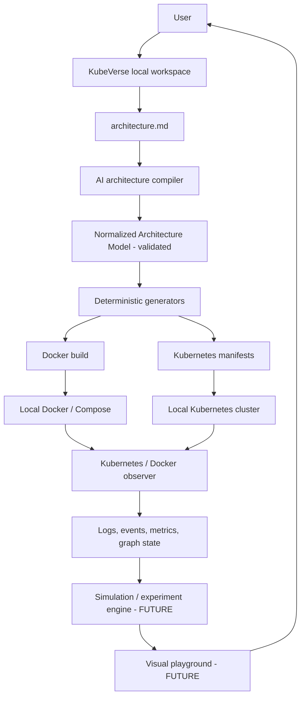
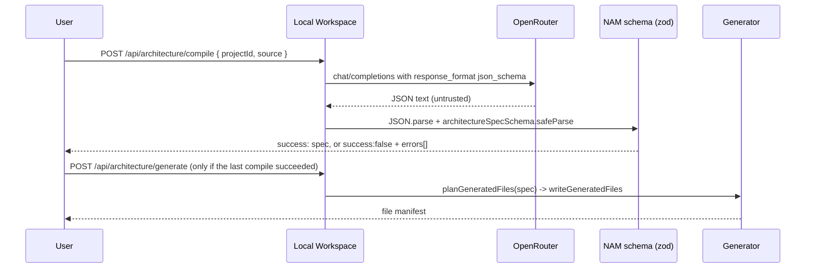
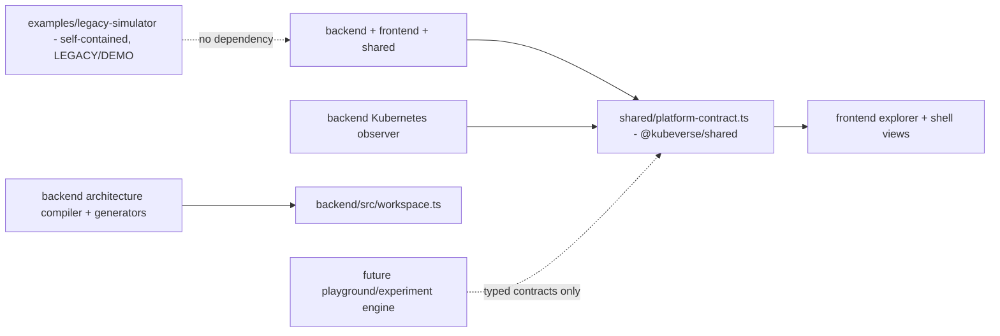

# KubeVerse Master Specification

**Status:** authoritative technical direction for KubeVerse.
**Scope:** local-first Kubernetes and Docker learning workstation with an AI-assisted architecture builder.
**Normative language:** **CURRENT** describes repository behavior verified from source, as of this document's last update. **PLANNED** is an approved design direction that has not been implemented. **FUTURE** is intentionally deferred to a later milestone. **LEGACY/DEMO** describes code preserved for reference that is not part of KubeVerse's product core. A section marked PLANNED or FUTURE must not be represented in the UI or documentation as available functionality.

This document supersedes the prior `KUBEBOS_MASTER_SPEC.md`. It carries forward that document's CURRENT/PLANNED/FUTURE discipline and most of its target-architecture thinking under the KubeVerse name, with one explicit product decision recorded in §15: the architecture compiler and generators were built now, deliberately ahead of the simulation/playground engine that document had sequenced first.

## 1. Project identity

KubeVerse is an open-source, local-first, interactive workstation for learning Docker, Kubernetes, distributed systems, and observability by describing a small application in plain language, generating a real runnable version of it, deploying it locally, and observing real local Kubernetes/Docker behavior against it.

KubeVerse is not a hosted SaaS dashboard, a managed Kubernetes service, or a replacement for production operations tooling. It does not run a cloud cluster, does not host a central project database, and does not upload a user's architecture files, generated source, or cluster state anywhere.

## 2. Vision and problem statement

1. A learner describes a small application in human-readable form (`architecture.md`).
2. KubeVerse's AI architecture compiler turns that into a schema-validated, normalized architecture model (the NAM) - the AI is never trusted directly; the schema validator is the source of truth.
3. Deterministic local generators turn the validated NAM into inspectable source code, Dockerfiles, Compose configuration, and Kubernetes manifests.
4. The learner builds and deploys the generated project to their own local Docker/Kubernetes.
5. KubeVerse's Kubernetes observer watches the resulting resources, logs, events, and metrics.
6. A future visual playground and guided experiments explain what happened and why (FUTURE - see §12-§13).

This milestone ("Part 1: Product Core") delivers steps 1-3 fully, the interfaces needed for step 4, and keeps the existing read-only observer (step 5) generic rather than tied to any fixed application. Steps 5's visualization redesign and 6 are future milestones.

## 3. Core philosophy and non-negotiable boundaries

### 3.1 Local-first

The user's machine owns project directories, architecture files, generated source code, generated manifests, Docker images, Kubernetes workloads, logs, and AI credentials. No KubeVerse-owned service stores a user's architecture, generated code, cluster state, logs, or AI key. The backend is a local Fastify process bound to `127.0.0.1`; nothing about this milestone requires internet access except the user's own call to their configured AI provider.

### 3.2 Real state over simulated state

Kubernetes API list/watch results are the source of truth for Kubernetes resources; Kubernetes Events enrich explanation but are best-effort. The UI may animate a resource transition after observing it, but must never invent Pods, scale actions, recovery outcomes, or network paths. The `examples/legacy-simulator/` workload's simulated latency/CPU/memory values are unrelated to real Kubernetes resource metrics and must always be understood as simulated demo behavior, not KubeVerse platform data.

### 3.3 Explicit authority and safe local execution

Read-only observation, local artifact generation, and (once wired) local build/deploy actions are distinct. AI output never executes directly: it produces a NAM proposal, which is schema-validated, and only the validated result reaches the deterministic generators. KubeVerse must never be an arbitrary shell or `kubectl` proxy to the browser.

### 3.4 Inspectability over magic

Generated source, Dockerfiles, Compose configuration, and Kubernetes manifests are plain files on disk in the user's project, visible and editable before any build/deploy action. The AI Builder UI can preview any generated file. AI output supplies a structured proposal; deterministic KubeVerse code generates every executable artifact.

## 4. Current implementation: verified inventory

### 4.1 Repository layout

```text
backend/                    Fastify TypeScript app: Kubernetes observer + KubeVerse product routes
frontend/                   React + TypeScript + Vite + React Flow app shell
shared/                     @kubeverse/shared - the backend<->frontend Kubernetes contract only
desktop/                    @kubeverse/desktop - Electron shell (Phase 3): owns local backend lifecycle, packaging
examples/legacy-simulator/  LEGACY/DEMO - the original Gateway/Validation/Security/OCR simulator (self-contained)
docs/                       Architecture notes (mostly scoped to the observer/explorer)
```

The root is an npm workspace (`shared`, `backend`, `frontend`, `desktop`). `npm run dev` starts the backend and Vite frontend together for browser development (unchanged by Phase 3); `npm run desktop:dev` additionally launches the Electron shell against those same dev servers; `npm run desktop:build` produces a production backend bundle, a production frontend build, and a packaged desktop artifact. `examples/legacy-simulator/` is its own independent npm workspace root - it does not participate in the root install and has no dependency on KubeVerse core.

### 4.2 Backend (`backend/`) - CURRENT

Fastify TypeScript application, `@kubeverse/backend`. Two concerns live in it today:

**Kubernetes observer** (unchanged in behavior from the prior explorer phase, only generalized): loads the active kubeconfig via `@kubernetes/client-node`, lists then watches Namespaces, Nodes, Deployments, ReplicaSets, DaemonSets, StatefulSets, Pods, Services, Ingresses, Jobs, CronJobs, ConfigMaps, Secrets, PersistentVolumes, PersistentVolumeClaims, StorageClasses, and Events, cluster-wide or filtered by `PLATFORM_NAMESPACES`. Serves `/snapshot`, `/resources`, `/resource/:kind/:namespace/:name`, `/timeline`, `/graph`, `/metrics`, `/logs`, and an `/events` SSE stream. It has **no application-specific assumptions**: the previous `/simulator/traffic` endpoint (which looked for a Pod labeled `app: gateway`) has been removed, and the frontend's default namespace is no longer hardcoded to `k8s-simulator`.

**KubeVerse product routes** (new this milestone):

| Route | Behavior |
| --- | --- |
| `GET /api/identity` | Returns the local installation identity (UUIDv7, created once). |
| `GET /api/settings` / `PUT /api/settings` | Read/write AI provider, model, and API key. The key is never echoed back (`hasApiKey: boolean` only). |
| `POST /api/settings/test-connection` | Calls the configured provider's credential check with the stored key. |
| `GET /api/environment` | Real (not fabricated) Docker and `kubectl` availability probes. |
| `GET /api/projects`, `POST /api/projects` | List recently opened projects; open or create a project directory. |
| `GET /api/projects/:id` | Project summary + `architecture.md` contents + generation provenance. |
| `GET /api/projects/:id/file?path=` | Path-traversal-guarded read of a generated file, for preview. |
| `POST /api/architecture/compile` | Sends `architecture.md` text to the configured AI provider, validates the JSON result against the NAM schema, and persists the result only if valid. |
| `POST /api/architecture/generate` | Deterministically generates source/Docker/Kubernetes files from the last validated NAM. |

### 4.3 Local identity, settings, and workspace (`backend/src/local/`, `backend/src/workspace.ts`) - CURRENT

- **Installation identity**: a hand-rolled RFC 9562 UUIDv7 generator (`backend/src/local/uuidv7.ts`; Node's `crypto.randomUUID()` only produces v4), created once and stored at `~/.kubeverse/identity.json`. Displayed as `KubeVerse · <uuid>`, never a raw external account identifier.
- **Settings (dev-mode fallback)**: `~/.kubeverse/settings.json`, written with `0o600` permissions, holding `{ aiProvider, model, apiKey }`. This is a **documented development fallback**, not the production design - see §7.
- **Local project workspace**: a project is a directory on disk. Opening/creating one writes `.kubeverse/metadata.json` (a UUIDv7 project ID, name, creation time), `architecture.md` (a starter template if new), and a `generated/` directory. `~/.kubeverse/recent-projects.json` holds only a most-recently-used list of paths - a convenience index, not a database; deleting it loses no project data because every project's own `.kubeverse/metadata.json` remains the source of truth for that project's identity.

### 4.4 Architecture compiler and Normalized Architecture Model (`backend/src/architecture/`) - CURRENT

The NAM (`backend/src/architecture/schema.ts`, `zod`) is the canonical, validated representation:

```text
ArchitectureSpec { name, version: 1, services: ServiceSpec[], traffic: TrafficEdge[] }
ServiceSpec {
  name (kebab-case), type (frontend|backend|worker|gateway|database|cache|other),
  runtime (node|mongodb|redis|postgres|mysql), port, protocol (http|tcp),
  env, dependsOn[], replicas, resources{requests,limits}, healthCheck{path,intervalSeconds,timeoutSeconds},
  volume?, expose
}
TrafficEdge { from, to, description? }
```

Semantic checks beyond shape: unique service names, `dependsOn` and traffic edges must reference declared services. `runtime: 'mongodb' | 'redis' | 'postgres' | 'mysql'` are managed dependencies with a well-known image (`backend/src/generators/managedService.ts`) and never get generated application source; only `runtime: 'node'` services do.

**Notable safety property of this schema**: dangerous configuration classes from the old spec's threat list - privileged containers, host PID/IPC/network, host filesystem mounts, arbitrary Linux capabilities - have no representation in the NAM schema at all. The AI cannot request them because there is no field for them; this is enforced structurally by the schema, not by a separate policy-rejection pass. A future dangerous-configuration policy layer (PLANNED, see §9) would matter more once the schema grows fields with that expressive power (for example, arbitrary Kubernetes manifest overrides).

**AI provider abstraction** (`backend/src/architecture/providers/`): a narrow `AiProvider` interface (`compileArchitecture`, `validateCredential`) so a future provider doesn't touch the compiler or routes. `openrouter.ts` is the only implementation today: it calls OpenRouter's OpenAI-compatible `/chat/completions` with `response_format: json_schema` (schema derived from the NAM zod schema via `zod-to-json-schema`), with a JSON-only system prompt as a fallback for models that don't honor structured output; `validateCredential` calls `GET /api/v1/key`.

**Compiler** (`backend/src/architecture/compiler.ts`): parses the provider's raw text (stripping markdown fences defensively), then runs it through `architectureSpecSchema.safeParse`. A provider response that fails to parse as JSON, or fails schema validation, is surfaced as a list of validation errors and is never treated as a usable architecture - this is the concrete implementation of "the validator, not the AI, is the source of truth" (§3.3, §3.4).

### 4.5 Generators (`backend/src/generators/`) - CURRENT

Deterministic, template-based, and covered by unit tests (`backend/src/generators/write.test.ts`) - the same validated NAM always produces the same files:

- **Node service generator** (`nodeService.ts`): for each `runtime: 'node'` service, writes `package.json` (Express dependency only), `src/server.js` (health/ready endpoints, a root info endpoint, and - if the service declares `dependsOn` - a `/status` endpoint that live-checks each dependency's `/health`), and a `Dockerfile`.
- **Managed service catalog** (`managedService.ts`): known image/port/volume-path/credential-env defaults for `mongodb`, `redis`, `postgres`, `mysql`.
- **Docker generator** (`docker.ts`): one `docker/docker-compose.yml` covering every service - builds for `node` services (build context pointing at the sibling `generated/<service>/`), well-known images for managed services, a single project network, named volumes for managed services with a mount path.
- **Kubernetes generator** (`kubernetes.ts`): `kubernetes/namespace.yaml`, and per service a `deployment.yaml` (probes when `protocol: http`, resource requests/limits, replicas, dependency env vars pointing at in-cluster DNS names), `service.yaml`, a `configmap.yaml` when the service declares plain env vars, a `secret.yaml` when a managed service has credential env vars (`stringData`, kept out of the ConfigMap deliberately), a `pvc.yaml` when a managed service needs persistent storage, and one aggregate `kubernetes/ingress.yaml` covering every `expose: true` HTTP service.
- **Writer** (`write.ts`): writes files to the project directory and returns a `{path, bytes, sha256}` manifest, persisted to the project's `.kubeverse/generated-state.json` alongside `lastCompiledAt`/`lastGeneratedAt` timestamps - this is the generation provenance record referenced in §6.2 of the prior spec's cache model.

### 4.6 Execution abstractions (`backend/src/execution/`) - CURRENT (interfaces only, not UI-wired)

Real `child_process` wrappers, not mocks: `checkDockerAvailable()`, `checkKubectlAvailable()` (wired to `GET /api/environment`, used by the Settings view), and `composeUp()`/`composeDown()`/`applyManifests()`/`deleteNamespace()` (implemented and unit-testable, intentionally **not** exposed via any route yet - they exist as the interface layer the future playground needs, per the product decision not to build execution/playground UI in this milestone).

### 4.7 Frontend (`frontend/`) - CURRENT

React 19, TypeScript, Vite, `@xyflow/react`, `@kubeverse/frontend`. An application shell (`App.tsx`) with a top bar (`KubeVerse` + live/offline status) and a sidebar (`Sidebar.tsx`: Playground, AI Builder, Architectures, Projects, with Settings pinned at the bottom), switching between five views with local component state (no router - the view count doesn't justify one yet):

- **Playground** (`views/PlaygroundView.tsx`): the prior explorer, moved verbatim - SSE-driven live graph, Inspector, Timeline, namespace/search/kind filters. Functionally unchanged except the default namespace is now "All namespaces" instead of the old hardcoded `k8s-simulator`.
- **Settings** (`views/SettingsView.tsx`): AI provider/model/API-key form (Save, Test Connection), real Docker/Kubernetes environment status, installation identity display.
- **Projects** (`views/ProjectsView.tsx`): open-or-create a local project directory by path, recent-projects list.
- **AI Builder** (`views/AIBuilderView.tsx`): `architecture.md` textarea with a local file picker (`FileReader`, no upload endpoint needed), Compile (shows validation errors or the structured NAM), Generate (enabled once compiled), a generated-file tree with click-to-preview.
- **Architectures** (`views/ArchitecturesView.tsx`): read-only view of the current project's `architecture.md` and compile/generate provenance.

`vite.config.ts` proxies the observer routes plus `/api/*` to the backend on port 4000; the removed `/simulator` proxy entry is gone with the endpoint it pointed at.

### 4.8 Legacy simulator (`examples/legacy-simulator/`) - LEGACY/DEMO

The original Gateway → Validation/Security/OCR fixed-architecture learning simulator (Nginx, four Node services on a shared `@simulator/shared` runtime helper package, MongoDB, Redis, matching Kubernetes manifests), preserved as a **worked example**, not as KubeVerse's product architecture. It is fully self-contained: its own `package.json`/workspaces, own `docker-compose.yml`, own `k8s/`, own test suite. It is not read by the architecture compiler or generators, and gets no special treatment from the observer. See `examples/legacy-simulator/README.md`.

## 5. Target conceptual system



I -> A -> M is CURRENT (§4.4). M -> G -> D/K is CURRENT (§4.5). D/K -> R/C is PLANNED (the execution abstractions exist per §4.6 but nothing calls them yet). O and X are CURRENT for the generic observer, unchanged in scope from the prior explorer phase. S and UI are FUTURE - the next major milestone.

### Component responsibilities

| Component | Responsibility | Status |
| --- | --- | --- |
| Workspace | Local project discovery, metadata, paths, lifecycle. | CURRENT |
| Architecture input | Preserve human input as `architecture.md`. | CURRENT |
| AI architecture compiler | Produce a schema-constrained architecture proposal; never trusted directly. | CURRENT (OpenRouter only) |
| Normalized Architecture Model | Canonical, versioned, validated representation. | CURRENT (version 1) |
| Generators | Deterministically create source, Dockerfiles, Compose, Kubernetes manifests from the NAM. | CURRENT |
| Build/deploy execution | Build/tag images; apply manifests to a local cluster. | PLANNED (interfaces exist, unwired) |
| Observer | Read current Kubernetes state, logs/events; generic, no fixed-architecture assumptions. | CURRENT |
| Experiment engine | Run allowlisted local experiments against real workloads with observed evidence. | FUTURE |
| Visualization / playground | Traffic, scaling, failure, and scheduling visualization on real observed state. | FUTURE |
| Learning engine | Progressive concept -> observation -> experiment -> challenge content. | FUTURE |

## 6. Local-first data, cache, and identity model

### 6.1 Sources of truth

| Data | Source of truth | Cache / derived copies |
| --- | --- | --- |
| Architecture input | `<project>/architecture.md` | none |
| Compiled NAM | `<project>/.kubeverse/generated-state.json` | rebuildable by recompiling |
| Generated source/manifests | `<project>/generated/`, `<project>/docker/`, `<project>/kubernetes/` | file hashes recorded in `generated-state.json` |
| Recent-projects index | `~/.kubeverse/recent-projects.json` | disposable MRU cache; each project's own `.kubeverse/metadata.json` is authoritative for that project's identity |
| Live Kubernetes state | Kubernetes API | Observer in-memory cache only |
| AI key | `~/.kubeverse/settings.json` (dev fallback, `0o600`) | never cached in plaintext anywhere else; never sent anywhere but the configured provider |

### 6.2 Identity model

| Identity | Meaning | Status |
| --- | --- | --- |
| Installation ID | UUIDv7 created once per local KubeVerse installation, shown as `KubeVerse · <uuid>`. | CURRENT |
| Project ID | UUIDv7 created in a project's own `.kubeverse/metadata.json`. | CURRENT |
| Firebase UID | Optional authentication-provider identifier; would never be displayed directly. | PLANNED, not wired |
| Session ID | UUIDv7 per UI/experiment session. | FUTURE |

## 7. Authentication, AI providers, and credentials

**CURRENT**: AI access is bring-your-own-key, OpenRouter only, entered in Settings. The key is stored at `~/.kubeverse/settings.json` with `0o600` permissions - a documented development fallback, never committed to the project repository (outside `~/.kubeverse` entirely), never echoed back by any API response (`GET /api/settings` returns `hasApiKey: boolean` only), and only injected into the OpenRouter request at compile time.

**PLANNED**: production desktop builds must move credential storage to OS keychain storage (Keychain on macOS, Credential Manager on Windows, Secret Service on Linux) via the desktop shell, not a plaintext file - not yet implemented in Phase 3A; `~/.kubeverse/settings.json` is still the actual storage even under the desktop app today (Phase 3 only changed the *location* the desktop app points it to, per §5's OS-idiomatic-paths note in the Phase 3 roadmap - the storage *mechanism* is unchanged). Additional providers (OpenAI, Anthropic, local Ollama, other OpenAI-compatible endpoints) can be added by implementing the existing `AiProvider` interface without touching the compiler or routes. Firebase Authentication / Google login for optional account identity is PLANNED and not implemented - no Firebase project or credential exists in this codebase; KubeVerse's installation identity (§6.2) does not depend on it.

## 8. Docker and Kubernetes generation

Covered in detail in §4.5. Current output is one `docker/docker-compose.yml` and a `kubernetes/` manifest tree per project, generated fresh on every `POST /api/architecture/generate` call (idempotent - re-running overwrites with the current NAM's output and updates the file manifest). `docker compose config` and manifest structure have been verified against the real `docker` and `yaml` tooling during development of this milestone; there was no reachable Kubernetes API server in the development environment, so manifests were validated for YAML/structural correctness, not applied to a live cluster.

## 9. AI architecture compiler execution safety



CURRENT: schema validation is the only gate today (§4.4's "notable safety property" - the schema itself has no field surface for privileged/host-namespace/host-mount configuration). PLANNED: once the schema grows any field with that expressive power (for example, arbitrary Kubernetes manifest overrides), a dedicated dangerous-configuration policy pass belongs in versioned code, not prompt text, exactly as the prior spec required. Explicit user approval before generation is implicit today (compile and generate are separate, user-triggered API calls) but there is no distinct "review and approve the NAM" UI step yet - PLANNED.

## 10. Observer, observability, and visualization - target evolution

Unchanged in scope from the explorer-phase document, with one correction: the observer and graph builder were already generic (they operate on Kubernetes kind/label/owner data, not application names), and the only actual coupling to the old simulator - the `/simulator/traffic` endpoint's `app: gateway` Pod-label lookup - has been removed (§4.2). Future observer improvements (resource-version-aware watch continuity, EndpointSlice/NetworkPolicy awareness, typed metrics providers, trace correlation) remain PLANNED/FUTURE, unchanged.

## 11. Simulation and experiment engine - FUTURE

Unchanged from the prior spec's design direction. Not implemented. The execution abstractions in §4.6 exist specifically so this milestone doesn't have to be redesigned when the experiment engine is built - it can call `composeUp`/`applyManifests` rather than re-implementing them.

## 12. Learning engine - FUTURE

Unchanged from the prior spec's design direction. Not implemented.

## 13. Security and privacy boundaries

- No remote architecture, generated code, Kubernetes state, logs, or cache by default; verified in this milestone - the only outbound network call in the product core is the user's own configured AI provider request and its key-validity check.
- AI credentials are local, `0o600`-permissioned, redacted from every API response, and never committed (outside `~/.kubeverse`, which is unrelated to any project's Git repository).
- Generated-file preview (`GET /api/projects/:id/file`) is path-traversal-guarded: the resolved path must remain within the project directory.
- Read-only Kubernetes credentials remain the default; no mutating Kubernetes route exists yet (§4.6).
- No arbitrary shell execution or generic `kubectl` proxy is exposed to the browser; the execution abstractions run fixed, parameterized commands (`docker compose up/down`, `kubectl apply -f <dir>`), never user-supplied shell strings.

## 14. Implementation sequence and explicit non-goals

The prior spec sequenced the architecture compiler and Docker/Kubernetes generation *after* the simulation/experiment engine, metrics integration, traffic generation, HPA, and failure experiments. **This milestone deliberately reorders that sequence**: the architecture compiler, NAM schema, and generators were built now, ahead of the simulation engine, per direct product decision - the reasoning being that the compiler/generator pipeline is how a user creates something worth exploring in the first place, and is independently valuable and shippable without the playground.

Explicitly not built in this milestone (unchanged non-goals, FUTURE, at the time this Phase 1 section was written): HPA, traffic simulator, Pod/OOM failure simulation, kube-proxy/scheduler/rollout visualization, replay, learning/tutorial engine, community sharing, instructor mode. Also explicitly deferred by product decision rather than by default non-goal at that time: a Tauri desktop shell scaffold (no Rust toolchain was available to build- or syntax-verify one during this milestone; the frontend/backend are already structured to drop into one - a standalone Vite SPA and a standalone local backend process - see §2 of the prior spec's desktop-shell direction), Firebase/Google authentication (§7), and any UI-wired "build/deploy" action (the abstractions exist per §4.6, but wiring them into a Playground UI is explicitly the next milestone's work, not this one's).

**Update (Phase 2, Phase 3)**: the traffic simulator, Pod/OOM failure simulation, and the UI-wired build/deploy action were all built in Phase 2 (`phase2_v2.3.0`). A desktop shell was built in Phase 3, but as **Electron**, not Tauri: the Rust-toolchain gap noted above was still unresolved when Phase 3 began, and rather than ship unverified Tauri scaffolding, Electron was chosen specifically because it could be built, packaged, and actually run in the implementing environment. Tauri remains a plausible future revisit if a Rust toolchain becomes available and the smaller-binary/lower-resource tradeoff becomes worth a rewrite of the desktop shell (not the React/Fastify core, which either desktop framework wraps unchanged). See §18 for the full phase roadmap.

## 15. Developer and contributor architecture



- Keep `@kubeverse/shared` scoped to the backend<->frontend Kubernetes contract only; it has no dependency on the architecture compiler, generators, or workspace code, and vice versa.
- Keep Kubernetes client access in backend observer code, not React components or graph layout code.
- Keep the generators deterministic and testable from a validated NAM (`backend/src/generators/write.test.ts` is the pattern to extend).
- The AI provider is the only place that talks to an external service; adding a provider means implementing `AiProvider`, not touching the compiler, routes, or generators.
- New features must identify their source of truth, persistence policy, authorization boundary, cleanup path, API contract, and whether data is real, simulated, or AI-proposed-then-validated.

## 16. Glossary

| Term | Meaning in KubeVerse |
| --- | --- |
| NAM | Normalized Architecture Model - the canonical, versioned, `zod`-validated architecture representation. |
| Managed runtime | A NAM service runtime (`mongodb`, `redis`, `postgres`, `mysql`) backed by a well-known image; gets infrastructure manifests but no generated application source. |
| Workspace / project | A local directory identified by a UUIDv7 in its own `.kubeverse/metadata.json`; the source of truth for that project. |
| Installation ID | The UUIDv7 identifying a local KubeVerse installation, shown in Settings. |
| Observer | Read-only component that lists/watches Kubernetes and projects a stable contract; generic, no fixed-application assumptions. |
| Legacy simulator | `examples/legacy-simulator/` - the original Gateway/Validation/Security/OCR demo, preserved as a worked example, not part of KubeVerse core. |
| Generator | Deterministic KubeVerse code that turns a validated NAM into source/Docker/Kubernetes files; never the AI. |
| Real | Directly observed from Kubernetes, local runtime, or an executed local request. |
| Simulated | Deliberately generated behavior/value from the legacy demo workload. |
| AI-proposed | Produced by the configured AI provider; not authoritative until it passes NAM schema validation. |

## 17. Decision checklist for future changes

1. Is it CURRENT, PLANNED, FUTURE, or LEGACY/DEMO, and does this change alter that status?
2. What is the source of truth and what is safely disposable cache?
3. Is data local, external-provider data (and if so, sent to which provider, and why), simulated, observed, or AI-proposed?
4. Does it require credentials, Kubernetes permissions, mutation authority, or user confirmation?
5. How is it constrained to local projects/namespaces and cleaned up?
6. What stable shared contract (`@kubeverse/shared`, the NAM schema, the `AiProvider` interface) is introduced or changed?
7. How can a user inspect and understand the resulting artifacts and outcomes before anything executes?

## 18. Roadmap

### Phase 1 - Core Application

Project architecture, project generation, Docker/Kubernetes integration, core foundation (§4.4-§4.6).

**Status: Complete.**

### Phase 2 - Playground & Simulation

Kubernetes topology, deterministic layout, drag/lock/Auto Layout, MiniMap, live timeline, traffic readiness, traffic simulation (1 visual dot = 10 real requests, edge-following particles that ride the real rendered React Flow SVG path), Pod failure visualization, real Kubernetes self-healing (a real Pod deletion, observed converging via the real observer/SSE stream - never a fabricated replacement), Docker host-port allocation, Kubernetes reconnect resilience.

**Status: Complete - `phase2_v2.3.0`.**

### Phase 3 - Desktop Application

- **3A (this milestone) - CURRENT, in progress:** Electron desktop shell (`desktop/`) that owns the local backend process's lifecycle (spawn, real `/health`-based readiness wait, clean SIGTERM-then-SIGKILL shutdown, single-instance lock); a production backend build (`backend/esbuild.config.js`, bundling first-party source, leaving real npm dependencies external); the backend optionally serving the built frontend from its own origin (`PLATFORM_STATIC_DIR`) so the desktop window's relative `fetch()`/`EventSource` calls need no code changes; OS-idiomatic config/project paths via Electron's `app.getPath()` (`desktop/src/appPaths.js`) *without* changing the browser dev-mode defaults (`~/.kubeverse`, `~/KubeVerse` are untouched); a minimal, isolated (`contextIsolation`, no `nodeIntegration`, empty preload bridge) renderer security boundary; Linux packaging (AppImage verified end-to-end as a real, standalone, extracted-and-run artifact; `.deb` configured but blocked on real maintainer-email/homepage metadata only a project owner can supply - see the Phase 3 audit's Limitations); Windows packaging (NSIS) configured but not yet built/verified in the implementing environment (no Windows host or reliable Wine cross-build path was available).
- **3B - PLANNED, not yet built:** OS keychain credential storage (replacing the plaintext `~/.kubeverse/settings.json`, per §7); a first-run environment-checklist UI inside the React app (reusing the existing `/api/environment` route - not a new observer); an explicit, user-triggered migration path from the browser dev-mode `~/.kubeverse`/`~/KubeVerse` locations to the desktop app's OS-idiomatic ones (deliberately not automatic/silent); auto-update wiring (`electron-updater` against signed GitHub Releases artifacts); a real CI pipeline building Windows/Linux artifacts on tag push; a real application icon and other branding assets (none exist in this repository today - Phase 3A did not fabricate placeholder branding).

### Phase 4 - Product & Identity (FUTURE)

Potential future work: Google sign-in, user identity, secure credential storage, account/preferences, onboarding. Not implemented; no Firebase project or OAuth credential exists in this codebase (§7).

### Phase 5 - Optional Collaboration / Cloud (FUTURE)

Potential future work: sharing, collaboration, optional cloud synchronization. KubeVerse remains local-first by default per §3.1; none of this is implemented, and signing in (Phase 4) must never imply uploading local project/Docker/Kubernetes data without explicit, separate user action.
