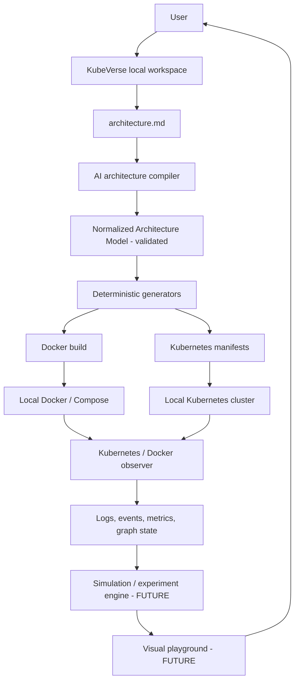
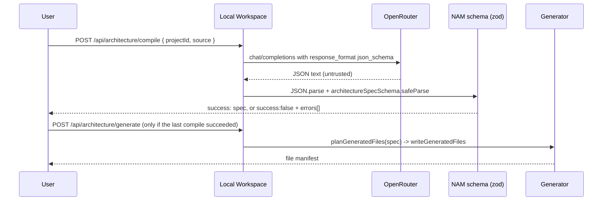
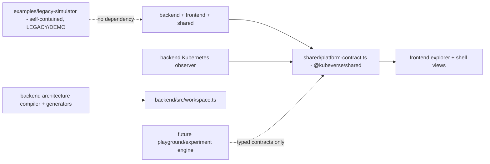

# KubeVerse Master Specification

**Status:** authoritative technical direction for KubeVerse.
**Scope:** local-first Kubernetes and Docker learning workstation with an AI-assisted architecture builder.
**Normative language:** **CURRENT** describes repository behavior verified from source, as of this document's last update. **PLANNED** is an approved design direction that has not been implemented. **FUTURE** is intentionally deferred to a later milestone. **LEGACY/DEMO** describes code preserved for reference that is not part of KubeVerse's product core. A section marked PLANNED or FUTURE must not be represented in the UI or documentation as available functionality.

This document supersedes the prior `KUBEBOS_MASTER_SPEC.md`. It carries forward that document's CURRENT/PLANNED/FUTURE discipline and most of its target-architecture thinking under the KubeVerse name, with one explicit product decision recorded in §15: the architecture compiler and generators were built now, deliberately ahead of the simulation/playground engine that document had sequenced first.

## 1. Project identity

KubeVerse is an open-source, local-first, interactive workstation for learning Docker, Kubernetes, distributed systems, and observability by describing a small application in plain language, generating a real runnable version of it, deploying it locally, and observing real local Kubernetes/Docker behavior against it.

KubeVerse is not a hosted SaaS dashboard, a managed Kubernetes service, or a replacement for production operations tooling. It does not run a cloud cluster, does not host a central project database, and does not upload a user's architecture files, generated source, or cluster state anywhere.

## 2. Vision and problem statement

1. A learner describes a small application in human-readable form (`architecture.md`).
2. KubeVerse's AI architecture compiler turns that into a schema-validated, normalized architecture model (the NAM) - the AI is never trusted directly; the schema validator is the source of truth.
3. Deterministic local generators turn the validated NAM into inspectable source code, Dockerfiles, Compose configuration, and Kubernetes manifests.
4. The learner builds and deploys the generated project to their own local Docker/Kubernetes.
5. KubeVerse's Kubernetes observer watches the resulting resources, logs, events, and metrics.
6. A future visual playground and guided experiments explain what happened and why (FUTURE - see §12-§13).

This milestone ("Part 1: Product Core") delivers steps 1-3 fully, the interfaces needed for step 4, and keeps the existing read-only observer (step 5) generic rather than tied to any fixed application. Steps 5's visualization redesign and 6 are future milestones.

## 3. Core philosophy and non-negotiable boundaries

### 3.1 Local-first

The user's machine owns project directories, architecture files, generated source code, generated manifests, Docker images, Kubernetes workloads, logs, and AI credentials. No KubeVerse-owned service stores a user's architecture, generated code, cluster state, logs, or AI key. The backend is a local Fastify process bound to `127.0.0.1`; nothing about this milestone requires internet access except the user's own call to their configured AI provider.

### 3.2 Real state over simulated state

Kubernetes API list/watch results are the source of truth for Kubernetes resources; Kubernetes Events enrich explanation but are best-effort. The UI may animate a resource transition after observing it, but must never invent Pods, scale actions, recovery outcomes, or network paths. The `examples/legacy-simulator/` workload's simulated latency/CPU/memory values are unrelated to real Kubernetes resource metrics and must always be understood as simulated demo behavior, not KubeVerse platform data.

### 3.3 Explicit authority and safe local execution

Read-only observation, local artifact generation, and (once wired) local build/deploy actions are distinct. AI output never executes directly: it produces a NAM proposal, which is schema-validated, and only the validated result reaches the deterministic generators. KubeVerse must never be an arbitrary shell or `kubectl` proxy to the browser.

### 3.4 Inspectability over magic

Generated source, Dockerfiles, Compose configuration, and Kubernetes manifests are plain files on disk in the user's project, visible and editable before any build/deploy action. The AI Builder UI can preview any generated file. AI output supplies a structured proposal; deterministic KubeVerse code generates every executable artifact.

## 4. Current implementation: verified inventory

### 4.1 Repository layout

```text
backend/                    Fastify TypeScript app: Kubernetes observer + KubeVerse product routes
frontend/                   React + TypeScript + Vite + React Flow app shell
shared/                     @kubeverse/shared - the backend<->frontend Kubernetes contract only
desktop/                    @kubeverse/desktop - Electron shell (Phase 3): owns local backend lifecycle, packaging, auto-update
examples/legacy-simulator/  LEGACY/DEMO - the original Gateway/Validation/Security/OCR simulator (self-contained)
docs/                       Architecture notes (mostly scoped to the observer/explorer)
scripts/                    Release engineering (Phase 3B): scripts/set-version.js, scripts/validate-release-artifacts.js
.github/workflows/          CI (ci.yml, every push/PR) and Release (release.yml, vX.Y.Z tag push only) - see RELEASING.md
```

The root is an npm workspace (`shared`, `backend`, `frontend`, `desktop`). `npm run dev` starts the backend and Vite frontend together for browser development (unchanged by Phase 3); `npm run desktop:dev` additionally launches the Electron shell against those same dev servers; `npm run desktop:build` produces a production backend bundle, a production frontend build, and a packaged desktop artifact. `examples/legacy-simulator/` is its own independent npm workspace root - it does not participate in the root install and has no dependency on KubeVerse core. See `RELEASING.md` for how a tagged version actually becomes a published GitHub Release.

### 4.2 Backend (`backend/`) - CURRENT

Fastify TypeScript application, `@kubeverse/backend`. Two concerns live in it today:

**Kubernetes observer** (unchanged in behavior from the prior explorer phase, only generalized): loads the active kubeconfig via `@kubernetes/client-node`, lists then watches Namespaces, Nodes, Deployments, ReplicaSets, DaemonSets, StatefulSets, Pods, Services, Ingresses, Jobs, CronJobs, ConfigMaps, Secrets, PersistentVolumes, PersistentVolumeClaims, StorageClasses, and Events, cluster-wide or filtered by `PLATFORM_NAMESPACES`. Serves `/snapshot`, `/resources`, `/resource/:kind/:namespace/:name`, `/timeline`, `/graph`, `/metrics`, `/logs`, and an `/events` SSE stream. It has **no application-specific assumptions**: the previous `/simulator/traffic` endpoint (which looked for a Pod labeled `app: gateway`) has been removed, and the frontend's default namespace is no longer hardcoded to `k8s-simulator`.

**KubeVerse product routes** (new this milestone):

| Route | Behavior |
| --- | --- |
| `GET /api/identity` | Returns the local installation identity (UUIDv7, created once). |
| `GET /api/settings` / `PUT /api/settings` | Read/write AI provider, model, and API key. The key is never echoed back (`hasApiKey: boolean` only). |
| `POST /api/settings/test-connection` | Calls the configured provider's credential check with the stored key. |
| `GET /api/environment` | Real (not fabricated) Docker and `kubectl` availability probes. |
| `GET /api/projects`, `POST /api/projects` | List recently opened projects; open or create a project directory. |
| `GET /api/projects/:id` | Project summary + `architecture.md` contents + generation provenance. |
| `GET /api/projects/:id/file?path=` | Path-traversal-guarded read of a generated file, for preview. |
| `POST /api/architecture/compile` | Sends `architecture.md` text to the configured AI provider, validates the JSON result against the NAM schema, and persists the result only if valid. |
| `POST /api/architecture/generate` | Deterministically generates source/Docker/Kubernetes files from the last validated NAM. |

### 4.3 Local identity, settings, and workspace (`backend/src/local/`, `backend/src/workspace.ts`) - CURRENT

- **Installation identity**: a hand-rolled RFC 9562 UUIDv7 generator (`backend/src/local/uuidv7.ts`; Node's `crypto.randomUUID()` only produces v4), created once and stored at `~/.kubeverse/identity.json`. Displayed as `KubeVerse · <uuid>`, never a raw external account identifier.
- **Settings (dev-mode fallback)**: `~/.kubeverse/settings.json`, written with `0o600` permissions, holding `{ aiProvider, model, apiKey }`. This is a **documented development fallback**, not the production design - see §7.
- **Local project workspace**: a project is a directory on disk. Opening/creating one writes `.kubeverse/metadata.json` (a UUIDv7 project ID, name, creation time), `architecture.md` (a starter template if new), and a `generated/` directory. `~/.kubeverse/recent-projects.json` holds only a most-recently-used list of paths - a convenience index, not a database; deleting it loses no project data because every project's own `.kubeverse/metadata.json` remains the source of truth for that project's identity.

### 4.4 Architecture compiler and Normalized Architecture Model (`backend/src/architecture/`) - CURRENT

The NAM (`backend/src/architecture/schema.ts`, `zod`) is the canonical, validated representation:

```text
ArchitectureSpec { name, version: 1, services: ServiceSpec[], traffic: TrafficEdge[] }
ServiceSpec {
  name (kebab-case), type (frontend|backend|worker|gateway|database|cache|other),
  runtime (node|mongodb|redis|postgres|mysql), port, protocol (http|tcp),
  env, dependsOn[], replicas, resources{requests,limits}, healthCheck{path,intervalSeconds,timeoutSeconds},
  volume?, expose
}
TrafficEdge { from, to, description? }
```

Semantic checks beyond shape: unique service names, `dependsOn` and traffic edges must reference declared services. `runtime: 'mongodb' | 'redis' | 'postgres' | 'mysql'` are managed dependencies with a well-known image (`backend/src/generators/managedService.ts`) and never get generated application source; only `runtime: 'node'` services do.

**Notable safety property of this schema**: dangerous configuration classes from the old spec's threat list - privileged containers, host PID/IPC/network, host filesystem mounts, arbitrary Linux capabilities - have no representation in the NAM schema at all. The AI cannot request them because there is no field for them; this is enforced structurally by the schema, not by a separate policy-rejection pass. A future dangerous-configuration policy layer (PLANNED, see §9) would matter more once the schema grows fields with that expressive power (for example, arbitrary Kubernetes manifest overrides).

**AI provider abstraction** (`backend/src/architecture/providers/`): a narrow `AiProvider` interface (`compileArchitecture`, `validateCredential`) so a future provider doesn't touch the compiler or routes. `openrouter.ts` is the only implementation today: it calls OpenRouter's OpenAI-compatible `/chat/completions` with `response_format: json_schema` (schema derived from the NAM zod schema via `zod-to-json-schema`), with a JSON-only system prompt as a fallback for models that don't honor structured output; `validateCredential` calls `GET /api/v1/key`.

**Compiler** (`backend/src/architecture/compiler.ts`): parses the provider's raw text (stripping markdown fences defensively), then runs it through `architectureSpecSchema.safeParse`. A provider response that fails to parse as JSON, or fails schema validation, is surfaced as a list of validation errors and is never treated as a usable architecture - this is the concrete implementation of "the validator, not the AI, is the source of truth" (§3.3, §3.4).

### 4.5 Generators (`backend/src/generators/`) - CURRENT

Deterministic, template-based, and covered by unit tests (`backend/src/generators/write.test.ts`) - the same validated NAM always produces the same files:

- **Node service generator** (`nodeService.ts`): for each `runtime: 'node'` service, writes `package.json` (Express dependency only), `src/server.js` (health/ready endpoints, a root info endpoint, and - if the service declares `dependsOn` - a `/status` endpoint that live-checks each dependency's `/health`), and a `Dockerfile`.
- **Managed service catalog** (`managedService.ts`): known image/port/volume-path/credential-env defaults for `mongodb`, `redis`, `postgres`, `mysql`.
- **Docker generator** (`docker.ts`): one `docker/docker-compose.yml` covering every service - builds for `node` services (build context pointing at the sibling `generated/<service>/`), well-known images for managed services, a single project network, named volumes for managed services with a mount path.
- **Kubernetes generator** (`kubernetes.ts`): `kubernetes/namespace.yaml`, and per service a `deployment.yaml` (probes when `protocol: http`, resource requests/limits, replicas, dependency env vars pointing at in-cluster DNS names), `service.yaml`, a `configmap.yaml` when the service declares plain env vars, a `secret.yaml` when a managed service has credential env vars (`stringData`, kept out of the ConfigMap deliberately), a `pvc.yaml` when a managed service needs persistent storage, and one aggregate `kubernetes/ingress.yaml` covering every `expose: true` HTTP service.
- **Writer** (`write.ts`): writes files to the project directory and returns a `{path, bytes, sha256}` manifest, persisted to the project's `.kubeverse/generated-state.json` alongside `lastCompiledAt`/`lastGeneratedAt` timestamps - this is the generation provenance record referenced in §6.2 of the prior spec's cache model.

### 4.6 Execution abstractions (`backend/src/execution/`) - CURRENT (interfaces only, not UI-wired)

Real `child_process` wrappers, not mocks: `checkDockerAvailable()`, `checkKubectlAvailable()` (wired to `GET /api/environment`, used by the Settings view), and `composeUp()`/`composeDown()`/`applyManifests()`/`deleteNamespace()` (implemented and unit-testable, intentionally **not** exposed via any route yet - they exist as the interface layer the future playground needs, per the product decision not to build execution/playground UI in this milestone).

### 4.7 Frontend (`frontend/`) - CURRENT

React 19, TypeScript, Vite, `@xyflow/react`, `@kubeverse/frontend`. An application shell (`App.tsx`) with a top bar (`KubeVerse` + live/offline status) and a sidebar (`Sidebar.tsx`: Playground, AI Builder, Architectures, Projects, with Settings pinned at the bottom), switching between five views with local component state (no router - the view count doesn't justify one yet):

- **Playground** (`views/PlaygroundView.tsx`): the prior explorer, moved verbatim - SSE-driven live graph, Inspector, Timeline, namespace/search/kind filters. Functionally unchanged except the default namespace is now "All namespaces" instead of the old hardcoded `k8s-simulator`.
- **Settings** (`views/SettingsView.tsx`): AI provider/model/API-key form (Save, Test Connection), real Docker/Kubernetes environment status, installation identity display.
- **Projects** (`views/ProjectsView.tsx`): open-or-create a local project directory by path, recent-projects list.
- **AI Builder** (`views/AIBuilderView.tsx`): `architecture.md` textarea with a local file picker (`FileReader`, no upload endpoint needed), Compile (shows validation errors or the structured NAM), Generate (enabled once compiled), a generated-file tree with click-to-preview.
- **Architectures** (`views/ArchitecturesView.tsx`): read-only view of the current project's `architecture.md` and compile/generate provenance.

`vite.config.ts` proxies the observer routes plus `/api/*` to the backend on port 4000; the removed `/simulator` proxy entry is gone with the endpoint it pointed at.

### 4.8 Legacy simulator (`examples/legacy-simulator/`) - LEGACY/DEMO

The original Gateway → Validation/Security/OCR fixed-architecture learning simulator (Nginx, four Node services on a shared `@simulator/shared` runtime helper package, MongoDB, Redis, matching Kubernetes manifests), preserved as a **worked example**, not as KubeVerse's product architecture. It is fully self-contained: its own `package.json`/workspaces, own `docker-compose.yml`, own `k8s/`, own test suite. It is not read by the architecture compiler or generators, and gets no special treatment from the observer. See `examples/legacy-simulator/README.md`.

## 5. Target conceptual system



I -> A -> M is CURRENT (§4.4). M -> G -> D/K is CURRENT (§4.5). D/K -> R/C is PLANNED (the execution abstractions exist per §4.6 but nothing calls them yet). O and X are CURRENT for the generic observer, unchanged in scope from the prior explorer phase. S and UI are FUTURE - the next major milestone.

### Component responsibilities

| Component | Responsibility | Status |
| --- | --- | --- |
| Workspace | Local project discovery, metadata, paths, lifecycle. | CURRENT |
| Architecture input | Preserve human input as `architecture.md`. | CURRENT |
| AI architecture compiler | Produce a schema-constrained architecture proposal; never trusted directly. | CURRENT (OpenRouter only) |
| Normalized Architecture Model | Canonical, versioned, validated representation. | CURRENT (version 1) |
| Generators | Deterministically create source, Dockerfiles, Compose, Kubernetes manifests from the NAM. | CURRENT |
| Build/deploy execution | Build/tag images; apply manifests to a local cluster. | PLANNED (interfaces exist, unwired) |
| Observer | Read current Kubernetes state, logs/events; generic, no fixed-architecture assumptions. | CURRENT |
| Experiment engine | Run allowlisted local experiments against real workloads with observed evidence. | FUTURE |
| Visualization / playground | Traffic, scaling, failure, and scheduling visualization on real observed state. | FUTURE |
| Learning engine | Progressive concept -> observation -> experiment -> challenge content. | FUTURE |

## 6. Local-first data, cache, and identity model

### 6.1 Sources of truth

| Data | Source of truth | Cache / derived copies |
| --- | --- | --- |
| Architecture input | `<project>/architecture.md` | none |
| Compiled NAM | `<project>/.kubeverse/generated-state.json` | rebuildable by recompiling |
| Generated source/manifests | `<project>/generated/`, `<project>/docker/`, `<project>/kubernetes/` | file hashes recorded in `generated-state.json` |
| Recent-projects index | `~/.kubeverse/recent-projects.json` | disposable MRU cache; each project's own `.kubeverse/metadata.json` is authoritative for that project's identity |
| Live Kubernetes state | Kubernetes API | Observer in-memory cache only |
| AI key | `~/.kubeverse/settings.json` (dev fallback, `0o600`) | never cached in plaintext anywhere else; never sent anywhere but the configured provider |

### 6.2 Identity model

| Identity | Meaning | Status |
| --- | --- | --- |
| Installation ID | UUIDv7 created once per local KubeVerse installation, shown as `KubeVerse · <uuid>`. | CURRENT |
| Project ID | UUIDv7 created in a project's own `.kubeverse/metadata.json`. | CURRENT |
| Google identity | Optional: `{uid, email?, name?, picture?}` from a completed Google sign-in brokered through Firebase Authentication, stored locally only (§7). `uid` is the **Firebase UID** (Identity Toolkit's `localId`) - the real, stable internal identity key since Phase 6, not Google's raw OAuth `sub` claim (which is discarded immediately after the Firebase exchange, at the `desktop/src/googleAuth.js`/`firebaseAuth.js` boundary). Entirely independent of Installation ID: a user can sign in/out of Google (or switch Google accounts) any number of times without ever changing their Installation ID, and KubeVerse functions fully with no Google identity at all. | CURRENT (Phase 5, identity key changed to Firebase UID in Phase 6) |
| Session ID | UUIDv7 per UI/experiment session. | FUTURE |

## 7. Authentication, AI providers, and credentials

**CURRENT - AI provider credentials**: AI access is bring-your-own-key, OpenRouter only, entered in Settings. The key is stored at `~/.kubeverse/settings.json` with `0o600` permissions - a documented development fallback, never committed to the project repository (outside `~/.kubeverse` entirely), never echoed back by any API response (`GET /api/settings` returns `hasApiKey: boolean` only), and only injected into the OpenRouter request at compile time. **Still PLANNED, not done in Phase 5**: moving this specific credential to OS keychain storage - deliberately out of scope for Phase 5 (see below) since it lives in the Fastify backend process, not Electron, and migrating it would mean either giving the backend process access to Electron's `safeStorage` (which only exists inside a real Electron process) or routing every settings read/write through IPC - a real architecture change to an already-working, well-tested system, not something Phase 5's "Google identifies the user" mandate required. Additional AI providers (OpenAI, Anthropic, local Ollama, other OpenAI-compatible endpoints) can still be added by implementing the existing `AiProvider` interface without touching the compiler or routes.

**CURRENT - default AI model (Phase 5 follow-up)**: `backend/src/local/settings.ts` exports `DEFAULT_OPENROUTER_MODEL` as the single source of truth for "what model does KubeVerse use when the user hasn't chosen one" - read by `readSettings()`/`writeSettings()` (a blank/whitespace-only stored model always resolves to this, on every read and write) and independently again by `architecture/compiler.ts`'s `compileArchitecture()` immediately before the OpenRouter request is built, so the guarantee holds regardless of caller. This closes a real, reproduced bug: Settings' model input previously initialized to an empty string before its own `GET /api/settings` fetch resolved, and `PUT /api/settings` persisted whatever was submitted verbatim (including that empty string) - once written, `{...defaults, ...parsed}` let the empty value win over the default forever, since the key was *present*, just blank, and every subsequent AI Builder compile sent OpenRouter a request with `"model": ""`, which OpenRouter correctly rejects with HTTP 400 "No models provided". The current default, `dots-studio/dots-3-note-preview:free`, was chosen by actually compiling a real architecture.md through the real pipeline (`compileArchitecture` → `openRouterProvider` → strict `json_schema` `response_format` → `architectureSpecSchema` validation) against several current OpenRouter `:free` models on 2026-08-28, not chosen from documentation alone: `z-ai/glm-5.2:free` and `google/gemma-4-31b-it:free` were both rate-limited (HTTP 429) at test time despite being listed as available; `nvidia/nemotron-3-super-120b-a12b:free` took over two minutes and returned no content; `minimax/minimax-m2.7:free` responded quickly but did not honor the strict schema (invented enum values, omitted the required `name` field). `dots-studio/dots-3-note-preview:free` produced a fully schema-valid result on two separate real runs and is genuinely free (`pricing.prompt`/`pricing.completion`: `"0"`). OpenRouter's free-tier lineup rotates over time - this reflects a verified-working choice as of this date, not a permanent guarantee, and a user can always override it in Settings (which now shows the real current default as its placeholder and in a "Default model is used unless you choose another" helper line, instead of a static string that could silently drift from the code).

**CURRENT - Google identity (Phase 5)**: desktop-only "Continue with Google" using the OAuth 2.0 Authorization Code flow with PKCE (RFC 7636) via a loopback redirect - the current Google-recommended flow for desktop/native apps, per Google's own native-app documentation (`https://developers.google.com/identity/protocols/oauth2/native-app`, `https://developers.google.com/identity/protocols/oauth2/resources/loopback-migration`, verified 2026-08-27). Entirely owned by the Electron main process (`desktop/src/googleAuth.js`, `desktop/src/authController.js`):

- The consent screen opens in the user's system default browser (`shell.openExternal`), never an embedded `BrowserWindow`/webview - Google has blocked OAuth through embedded webviews since 2023 specifically against credential-phishing risk, confirmed still in force (`https://developers.googleblog.com/upcoming-security-changes-to-googles-oauth-20-authorization-endpoint-in-embedded-webviews/`, `https://developers.google.com/identity/protocols/oauth2/policies`).
- A loopback-only HTTP server (`127.0.0.1`, ephemeral port) receives the redirect; the authorization request carries a PKCE `code_challenge` (S256) and a `state` value that's verified on the way back.
- **No client secret is ever requested, sent, held, or stored anywhere in this codebase** - only a `client_id` (not confidential) is configured, via the `KUBEVERSE_GOOGLE_CLIENT_ID` environment variable at launch (see `RELEASING.md`/`.env.example` for how a builder supplies their own). The token exchange (`POST https://oauth2.googleapis.com/token`) omits `client_secret` entirely: a "Desktop app" OAuth client is a public client per RFC 8252 §8.5 ("native apps cannot keep secrets"), and PKCE - not a secret embedded in a distributed binary - is what actually secures this exchange.
- The ID token Google returns is decoded locally for its `sub`/`email`/`name`/`picture` claims (`desktop/src/idToken.js`) but not cryptographically re-verified - deliberately: it arrives directly from Google's own token endpoint over a TLS connection the main process itself initiated, the same trust basis any confidential server-side client already relies on, not a hand-off from an untrusted third party a signature would need to guard against.
- The renderer never receives an access token, a refresh token, or a client secret - `preload.js` exposes only `signInWithGoogle`/`signOutOfGoogle`/`getAuthState`/`onAuthState`, and every one of them returns/broadcasts the minimal identity object at most (`desktop/src/authController.js`).

**CURRENT - Google credential storage**: the session refresh token (needed to avoid asking for Google login on every launch) is encrypted with Electron's own built-in `safeStorage` API - OS Keychain on macOS, DPAPI on Windows, Secret Service/libsecret or KWallet on Linux - before being written to `<userData>/auth-state.json`; the identity fields (`uid`/`email`/`name`/`picture`) are not secret and are stored in the clear alongside the encrypted blob. No new dependency and no homemade encryption: `safeStorage` is part of Electron itself. If OS-level secure storage is genuinely unavailable (`safeStorage.isEncryptionAvailable() === false`, e.g. some minimal Linux setups with no keyring), the refresh token is simply never persisted - the user just signs in again next launch - rather than ever falling back to a plaintext file. **Restoring a session on a later launch never contacts Google or Firebase at all**: the locally stored identity (captured at the original sign-in) is trusted as-is, which is also why ordinary launch/local-project access never depends on network connectivity (§13). A lazy, non-blocking background refresh (`desktop/src/authController.js`, 5s after launch, `.unref()`'d) attempts to rotate the Firebase session in the background if a refresh token is present, but never signs the user out on failure - an offline launch and a revoked session look identical from a local refresh-call failure, and "stay signed in locally, let the next real network operation surface any actual problem" was judged safer than guessing.

**CURRENT - Firebase Authentication as the identity broker (Phase 6)**: Phase 5's Google OAuth flow above is unchanged and still owns getting a real Google ID token onto the device. Phase 6 adds exactly one new step after it: that Google ID token is exchanged for a real Firebase session, making **Firebase Authentication** (not raw Google OAuth) the actual identity provider - `uid` (Firebase's `localId`) is the stable internal identity, per §6.2.

- **Architecture chosen, and why**: the exchange is a single plain HTTPS POST from the Electron main process to Google Identity Toolkit's REST API - `POST https://identitytoolkit.googleapis.com/v1/accounts:signInWithIdp?key=<Web API key>` with the Google ID token as the IDP credential (`desktop/src/firebaseAuth.js`), using Node's built-in `fetch`, exactly like `googleAuth.js` already does for the Google token exchange - **zero new npm dependencies**. This was chosen deliberately over the Firebase Admin SDK / Cloud Function pattern common in Electron+Firebase tutorials, which requires a privileged service-account credential and a KubeVerse-owned server component - both explicitly forbidden by this project's local-first, no-cloud-backend boundary (§13). Session refresh reuses the same pattern against `https://securetoken.googleapis.com/v1/token`.
- **Firebase Web API key is not a secret**: per Firebase's own security guidance, "API keys restricted to Firebase services do not need to be treated as secrets, and it's safe to include them in your code or configuration files" - unlike an Admin SDK private key (never used anywhere in this codebase). It is configured the same way as the Google client ID: `KUBEVERSE_FIREBASE_API_KEY`, an environment variable read only by the Electron main process (`desktop/src/main.js`), never hardcoded, never present in `.env.example`'s real form (see that file for the exact Firebase Console setup steps, including whitelisting the existing Desktop app OAuth client ID under Firebase's Google provider settings so Phase 5's client can be reused without minting a second one).
- **Missing configuration fails gracefully**: if either `KUBEVERSE_GOOGLE_CLIENT_ID` or `KUBEVERSE_FIREBASE_API_KEY` is absent, "Continue with Google" surfaces a clear, safe error (`"Authentication is not configured for this build."`-class message via `sanitizeAuthError.js`) rather than crashing or silently no-opping; KubeVerse launches and works fully either way (§6.2).
- **Firebase's own console is the account-visibility mechanism** - by product decision, this milestone does not add a KubeVerse admin dashboard or a user database of any kind just to let the product owner see registered-user counts; Firebase Authentication's own Console (Users tab) already provides this for free, with zero additional code, data collection, or attack surface in KubeVerse itself.
- **Data boundary, restated precisely**: `Google account → Firebase Authentication → KubeVerse identity (uid/email/name/picture)`, stored only in `<userData>/auth-state.json`. Firebase Authentication is used for identity only - this milestone introduces no Firestore, Realtime Database, Firebase Storage, Firebase Analytics, or any other Firebase product, and no KubeVerse project, architecture, generated file, simulation state, or AI-provider credential is ever sent to Firebase or any Google endpoint (§13 restates and re-proves this).

**CURRENT - Google branding asset (Phase 6)**: the "Continue with Google" button uses Google's own official Identity "G" logo, sourced directly from Google's branding-guidelines-linked asset kit (`https://developers.google.com/static/identity/images/signin-assets.zip`, the Dark/Square/no-text SVG variant), stored unmodified at `frontend/src/assets/google-g-logo-dark.svg` (and `branding/google-g-logo-dark.svg`) - not a fabricated, recolored, or hand-drawn substitute. The asset uses a modern masked-gradient SVG technique; it was rendered via a real headless-browser screenshot during development to confirm it displays correctly before use, rather than trusting raw markup inspection alone.

## 8. Docker and Kubernetes generation

Covered in detail in §4.5. Current output is one `docker/docker-compose.yml` and a `kubernetes/` manifest tree per project, generated fresh on every `POST /api/architecture/generate` call (idempotent - re-running overwrites with the current NAM's output and updates the file manifest). `docker compose config` and manifest structure have been verified against the real `docker` and `yaml` tooling during development of this milestone; there was no reachable Kubernetes API server in the development environment, so manifests were validated for YAML/structural correctness, not applied to a live cluster.

## 9. AI architecture compiler execution safety



CURRENT: schema validation is the only gate today (§4.4's "notable safety property" - the schema itself has no field surface for privileged/host-namespace/host-mount configuration). PLANNED: once the schema grows any field with that expressive power (for example, arbitrary Kubernetes manifest overrides), a dedicated dangerous-configuration policy pass belongs in versioned code, not prompt text, exactly as the prior spec required. Explicit user approval before generation is implicit today (compile and generate are separate, user-triggered API calls) but there is no distinct "review and approve the NAM" UI step yet - PLANNED.

## 10. Observer, observability, and visualization - target evolution

Unchanged in scope from the explorer-phase document, with one correction: the observer and graph builder were already generic (they operate on Kubernetes kind/label/owner data, not application names), and the only actual coupling to the old simulator - the `/simulator/traffic` endpoint's `app: gateway` Pod-label lookup - has been removed (§4.2). Future observer improvements (resource-version-aware watch continuity, EndpointSlice/NetworkPolicy awareness, typed metrics providers, trace correlation) remain PLANNED/FUTURE, unchanged.

## 11. Simulation and experiment engine - FUTURE

Unchanged from the prior spec's design direction. Not implemented. The execution abstractions in §4.6 exist specifically so this milestone doesn't have to be redesigned when the experiment engine is built - it can call `composeUp`/`applyManifests` rather than re-implementing them.

## 12. Learning engine - FUTURE

Unchanged from the prior spec's design direction. Not implemented.

## 13. Security and privacy boundaries

- No remote architecture, generated code, Kubernetes state, logs, or cache by default; verified in this milestone - the only outbound network call in the product core is the user's own configured AI provider request and its key-validity check.
- AI credentials are local, `0o600`-permissioned, redacted from every API response, and never committed (outside `~/.kubeverse`, which is unrelated to any project's Git repository).
- Generated-file preview (`GET /api/projects/:id/file`) is path-traversal-guarded: the resolved path must remain within the project directory.
- Read-only Kubernetes credentials remain the default; no mutating Kubernetes route exists yet (§4.6).
- No arbitrary shell execution or generic `kubectl` proxy is exposed to the browser; the execution abstractions run fixed, parameterized commands (`docker compose up/down`, `kubectl apply -f <dir>`), never user-supplied shell strings.
- **Google/Firebase identity never gates or contains local functionality/data (Phase 5, identity broker changed to Firebase in Phase 6)**: projects, `architecture.md`, generated source, Docker/Kubernetes manifests, project metadata, Playground/simulation/traffic-experiment state, and the AI provider key are never uploaded, synced, or referenced anywhere in the Google/Firebase identity payload or either OAuth/token-exchange call - proven, not just asserted, by `authController.test.js`/`firebaseAuth.test.js`/`desktop.test.ts`'s explicit assertions that the identity object never contains more than `uid`/`email`/`name`/`picture`, and by there being no KubeVerse-owned server for any of this to be sent to in the first place (§14). Signing out deletes exactly one local file (`<userData>/auth-state.json`) and nothing else - it cannot reach a project directory or `~/.kubeverse/settings.json`, since `desktop/src/authState.js`'s delete function is never given a path to either.
- **No Firebase product beyond Authentication is used (Phase 6)**: no Firestore, Realtime Database, Firebase Storage, Firebase Analytics, Cloud Functions, or Firebase Admin SDK exists anywhere in this codebase - verified by the packaged-app inspection in RELEASING.md-style checks (no service-account JSON, no private key, no `client_secret`, no `.env` file bundled in the packaged app; only a public `client_id` and a non-secret Firebase Web API key are read from environment variables at runtime). Firebase Authentication's own Console is the only place account/user counts are visible - KubeVerse itself has no user database.
- No telemetry, analytics, or behavioral tracking was introduced by Phase 5, Phase 6, or any prior phase - the only outbound network calls Phase 5/6 add are the user's own explicit "Continue with Google" click (to `accounts.google.com`/`oauth2.googleapis.com`) and the resulting Firebase identity exchange/refresh (`identitytoolkit.googleapis.com`/`securetoken.googleapis.com`) - nothing else; there is no periodic check-in, no usage reporting, and no KubeVerse-owned backend to report to.

## 14. Implementation sequence and explicit non-goals

The prior spec sequenced the architecture compiler and Docker/Kubernetes generation *after* the simulation/experiment engine, metrics integration, traffic generation, HPA, and failure experiments. **This milestone deliberately reorders that sequence**: the architecture compiler, NAM schema, and generators were built now, ahead of the simulation engine, per direct product decision - the reasoning being that the compiler/generator pipeline is how a user creates something worth exploring in the first place, and is independently valuable and shippable without the playground.

Explicitly not built in this milestone (unchanged non-goals, FUTURE, at the time this Phase 1 section was written): HPA, traffic simulator, Pod/OOM failure simulation, kube-proxy/scheduler/rollout visualization, replay, learning/tutorial engine, community sharing, instructor mode. Also explicitly deferred by product decision rather than by default non-goal at that time: a Tauri desktop shell scaffold (no Rust toolchain was available to build- or syntax-verify one during this milestone; the frontend/backend are already structured to drop into one - a standalone Vite SPA and a standalone local backend process - see §2 of the prior spec's desktop-shell direction), Firebase/Google authentication (§7), and any UI-wired "build/deploy" action (the abstractions exist per §4.6, but wiring them into a Playground UI is explicitly the next milestone's work, not this one's).

**Update (Phase 2, Phase 3)**: the traffic simulator, Pod/OOM failure simulation, and the UI-wired build/deploy action were all built in Phase 2 (`phase2_v2.3.0`). A desktop shell was built in Phase 3, but as **Electron**, not Tauri: the Rust-toolchain gap noted above was still unresolved when Phase 3 began, and rather than ship unverified Tauri scaffolding, Electron was chosen specifically because it could be built, packaged, and actually run in the implementing environment. Tauri remains a plausible future revisit if a Rust toolchain becomes available and the smaller-binary/lower-resource tradeoff becomes worth a rewrite of the desktop shell (not the React/Fastify core, which either desktop framework wraps unchanged). See §18 for the full phase roadmap.

## 15. Developer and contributor architecture



- Keep `@kubeverse/shared` scoped to the backend<->frontend Kubernetes contract only; it has no dependency on the architecture compiler, generators, or workspace code, and vice versa.
- Keep Kubernetes client access in backend observer code, not React components or graph layout code.
- Keep the generators deterministic and testable from a validated NAM (`backend/src/generators/write.test.ts` is the pattern to extend).
- The AI provider is the only place that talks to an external service; adding a provider means implementing `AiProvider`, not touching the compiler, routes, or generators.
- New features must identify their source of truth, persistence policy, authorization boundary, cleanup path, API contract, and whether data is real, simulated, or AI-proposed-then-validated.

## 16. Glossary

| Term | Meaning in KubeVerse |
| --- | --- |
| NAM | Normalized Architecture Model - the canonical, versioned, `zod`-validated architecture representation. |
| Managed runtime | A NAM service runtime (`mongodb`, `redis`, `postgres`, `mysql`) backed by a well-known image; gets infrastructure manifests but no generated application source. |
| Workspace / project | A local directory identified by a UUIDv7 in its own `.kubeverse/metadata.json`; the source of truth for that project. |
| Installation ID | The UUIDv7 identifying a local KubeVerse installation, shown in Settings. |
| Observer | Read-only component that lists/watches Kubernetes and projects a stable contract; generic, no fixed-application assumptions. |
| Legacy simulator | `examples/legacy-simulator/` - the original Gateway/Validation/Security/OCR demo, preserved as a worked example, not part of KubeVerse core. |
| Generator | Deterministic KubeVerse code that turns a validated NAM into source/Docker/Kubernetes files; never the AI. |
| Real | Directly observed from Kubernetes, local runtime, or an executed local request. |
| Simulated | Deliberately generated behavior/value from the legacy demo workload. |
| AI-proposed | Produced by the configured AI provider; not authoritative until it passes NAM schema validation. |

## 17. Decision checklist for future changes

1. Is it CURRENT, PLANNED, FUTURE, or LEGACY/DEMO, and does this change alter that status?
2. What is the source of truth and what is safely disposable cache?
3. Is data local, external-provider data (and if so, sent to which provider, and why), simulated, observed, or AI-proposed?
4. Does it require credentials, Kubernetes permissions, mutation authority, or user confirmation?
5. How is it constrained to local projects/namespaces and cleaned up?
6. What stable shared contract (`@kubeverse/shared`, the NAM schema, the `AiProvider` interface) is introduced or changed?
7. How can a user inspect and understand the resulting artifacts and outcomes before anything executes?

## 18. Roadmap

### Phase 1 - Core Application

Project architecture, project generation, Docker/Kubernetes integration, core foundation (§4.4-§4.6).

**Status: Complete.**

### Phase 2 - Playground & Simulation

Kubernetes topology, deterministic layout, drag/lock/Auto Layout, MiniMap, live timeline, traffic readiness, traffic simulation (1 visual dot = 10 real requests, edge-following particles that ride the real rendered React Flow SVG path), Pod failure visualization, real Kubernetes self-healing (a real Pod deletion, observed converging via the real observer/SSE stream - never a fabricated replacement), Docker host-port allocation, Kubernetes reconnect resilience.

**Status: Complete - `phase2_v2.3.0`.**

### Phase 3 - Desktop Application

- **3A - Complete:** Electron desktop shell (`desktop/`) that owns the local backend process's lifecycle (spawn, real `/health`-based readiness wait, clean SIGTERM-then-SIGKILL shutdown, single-instance lock, honest recovery UI if the backend exits unexpectedly after startup); a production backend build (`backend/esbuild.config.js`, bundling first-party source, leaving real npm dependencies external, staged production-only via `desktop/scripts/prepare-backend-deps.js`); the backend optionally serving the built frontend from its own origin (`PLATFORM_STATIC_DIR`) so the desktop window's relative `fetch()`/`EventSource` calls need no code changes; OS-idiomatic config/project paths via Electron's `app.getPath()` (`desktop/src/appPaths.js`, keyed off a real top-level `productName` so dev and packaged Electron runs share one consistent identity) *without* changing the browser dev-mode defaults (`~/.kubeverse`, `~/KubeVerse` are untouched); a minimal, isolated (`contextIsolation`, no `nodeIntegration`, a narrow preload bridge) renderer security boundary; a real first-launch environment checklist (`frontend/src/views/OnboardingView.tsx`, desktop-only, reusing `/health`/`/api/environment`/`/ready` - no second detection system) whose completion is persisted locally (`desktop/src/setupState.js`, a JSON file in `app.getPath('userData')`) and never re-shown to a returning user; real official branding (`branding/` - the supplied KubeVerse mark/icon-tile SVGs, used unmodified as the source of truth) integrated as the app/AppImage/installer icon, the favicon, the TopBar logo, and the onboarding/loading screens; Linux AppImage packaging verified end-to-end as a real, standalone, extracted-and-run artifact with the real icon baked in.
- **3B - Complete (this milestone): distribution, release engineering, and updates.** One authoritative version (root `package.json`, synced to every workspace's `package.json` and to the internal `@kubeverse/shared` dependency pin by `scripts/set-version.js`, checked by `desktop/src/version.test.js`); a documented `vX.Y.Z` git tag convention (`RELEASING.md`) - tags are never created or pushed automatically by any script or workflow; a GitHub Actions CI workflow (`.github/workflows/ci.yml`) that installs, tests, typechecks, and builds on every push to `main` and every pull request, then packages Linux (`ubuntu-latest`) and Windows (`windows-latest`; no macOS yet) artifacts in a matrix job and validates them (`scripts/validate-release-artifacts.js`: exists, non-zero size, correctly named, correct version) before uploading them as short-lived workflow artifacts - this never publishes a release; a real `.deb` target fixed (author email/homepage added, a `linux.description` override added so Debian metadata shows a real user-facing description instead of package.json's internal engineering comment) so both Linux targets (AppImage + `.deb`) now build successfully, where Phase 3A had only AppImage; a tag-triggered release workflow (`.github/workflows/release.yml`, `on: push: tags: 'v*.*.*'`, `permissions: contents: write`) that re-runs the full test suite against the tagged commit, verifies the tag matches `package.json`'s version, then runs `electron-builder --publish always` (`desktop/package.json`'s new `release` script) on both Linux and Windows runners to build and publish real GitHub Release artifacts using the workflow's own auto-provided `GITHUB_TOKEN` - no custom secret required; auto-update via `electron-updater` (version pinned to `^6.8.9`, confirmed dependency-compatible with the installed `electron-builder@^26.15.3` via a matching `builder-util-runtime` version, not blindly upgraded) wired narrowly into the main process only (`desktop/src/updater.js`, `autoDownload: false`, `autoInstallOnAppQuit: false`), exposed to the renderer through five narrow, named IPC channels only (`checkForUpdates`, `getUpdateState`, `downloadUpdate`, `quitAndInstall`, plus an `onUpdateState` push event) - never raw filesystem/shell/`electron-updater` access; a non-forced update UX (a silent-unless-actionable `UpdateBanner.tsx` for "available"/"downloading"/"downloaded" only, plus an always-visible manual "Check for Updates" status/action pair in Settings that also surfaces "checking"/"up to date"/real error text) driven by real electron-updater events only, with the decision/formatting logic extracted into a pure, unit-tested module (`frontend/src/updateLogic.ts`) since `electron-updater` itself can only run inside a live Electron process; a check once per launch plus on-demand from Settings, never polling; offline-safe by construction (a failed check just produces an `error` state with the real error text - the app, local projects, Docker, and Kubernetes access are entirely unaffected); no custom updater transport - GitHub Releases only, via electron-updater's own provider, no invented endpoints or disabled certificate validation. **The automatic once-per-launch check's exact trigger mechanism changed twice after this milestone** - see Phase 7 for the current, final design (briefly disabled entirely in between, then re-implemented anchored to real window readiness rather than this milestone's original flat 5-second timer).
- **3C - PLANNED, not yet built:** code signing (Windows Authenticode via `CSC_LINK`/`CSC_KEY_PASSWORD`, Linux AppImage/`.deb` signing) - genuinely not configured, no certificate exists in this codebase; today's release artifacts are unsigned, and `RELEASING.md` §6 says so explicitly rather than claiming otherwise. Also PLANNED: OS keychain credential storage (replacing the plaintext `~/.kubeverse/settings.json`, per §7); an explicit, user-triggered migration path from the browser dev-mode `~/.kubeverse`/`~/KubeVerse` locations to the desktop app's OS-idiomatic ones (deliberately not automatic/silent); a genuine Windows-runner-verified NSIS build (the Windows packaging path exists in CI/release workflows as of 3B but has not yet actually executed on GitHub's infrastructure, since nothing has been pushed/tagged there yet); macOS packaging; nightly/beta update channels.

### Phase 4 - Hardening & Public-Release Readiness

**Status: Complete (this milestone).** A full-journey audit and correctness/security hardening pass across the already-built product (Phases 1-3), not a new feature phase - the roadmap is renumbered from this point on (the former Phase 4/5 below become 5/6) to keep phase numbers reflecting actual chronological order, matching the precedent already set in §14.

Real bugs found and fixed by actually running the app end-to-end against a live local Docker/Kubernetes cluster (not just reading code or trusting unit tests, per this milestone's own mandate):

- **A managed-runtime protocol/probe bug that crash-looped Pods forever.** The NAM schema allowed (and defaulted) `protocol: 'http'` for `mongodb`/`redis`/`postgres`/`mysql` services, which never speak HTTP; the Kubernetes generator faithfully turned that into an `httpGet` liveness/readiness probe, which Redis's own cross-protocol-scripting defense treats as an attack and drops - reproduced live (an 8-hour-old real CrashLoopBackOff), fixed structurally at the schema level (`architecture/schema.ts` now forces `protocol: 'tcp'` for every managed runtime, the same "impossible to represent" discipline as the schema's existing dangerous-configuration-class guarantee), with a matching `tcpSocket` probe added in the generator (`generators/kubernetes.ts`) and the same TCP-vs-HTTP distinction applied to a generated service's own `/status` dependency check (`generators/nodeService.ts`). `POST /api/architecture/generate` now also re-validates the persisted spec against the *current* schema on every call (`routes/architecture.ts`), so an already-compiled project picks up a schema fix like this one without requiring a recompile - verified by re-running `generate` against the live crash-looping project and watching the real Pod recover to `1/1 Running`.
- **A real security gap: permissive CORS.** `backend/src/server.ts` registered `@fastify/cors` with `origin: true`, reflecting any request Origin - unnecessary (the browser only ever reaches this backend same-origin, via Vite's server-side dev proxy or the packaged app's own static-serving origin) and dangerous (this backend can run `docker compose`/`kubectl apply`/delete Pods/generate traffic load; permissive CORS would let any webpage a user has open make those same requests cross-origin). Removed entirely.
- **A symlink-based path-traversal gap** in `GET /api/projects/:id/file` (the generated-file preview route): its traversal guard was purely lexical (`path.resolve`/`path.relative`), which correctly rejects `../`-style strings but never touches the filesystem - a symlink inside a project directory pointing outside it could still be read. Fixed with an additional `realpathSync`-based check.
- **A frontend routing/error-masking bug that made Settings actively lie about cluster state.** `frontend/vite.config.ts`'s dev proxy never included `/health`/`/ready`/`/live` (real backend routes `api.ts` calls directly), so in browser dev mode those requests silently hit Vite's own SPA fallback (200 OK, HTML) instead of the backend - and `api.ts`'s `asJson()` swallowed the resulting JSON-parse failure into a fake `{}` "success" instead of a real error. Net effect, confirmed live: Settings' Kubernetes badge showed "Unavailable" at the exact same moment the Playground showed a fully healthy, connected cluster. Both the missing proxy entries and `asJson`'s silent-failure behavior are fixed.
- **A Windows-only bug**: `workspace.ts`'s no-name project fallback split the resolved absolute path on a hardcoded `/` to get a display name, which would return the *entire* path (not just the trailing folder name) on Windows, where `resolve()` uses `\`. Fixed with `path.basename()`.
- A practical accessibility pass (not a full rewrite): `LabDrawer` and `NewProjectModal` now close on Escape from anywhere inside them (previously only while a specific input was focused, or not at all); the Playground's inspector-collapse toggle and its dismissible Lab-error banner now have real accessible names/semantics (the latter is a real `<button>`, not a mouse-only `onClick` div); key status/error surfaces (`observer-warning` banners, the new-project error message) carry `aria-live`/`role="alert"` so a screen-reader user is notified without having to go looking.
- A Windows-readiness code audit (`execution/dockerRunner.ts`, `execution/kubernetesRunner.ts`, `desktop/src/*.js`, every `process.platform` site) found no other concrete breakage - `docker`/`kubectl` are spawned via `execFile` with real argv arrays (no `shell: true` anywhere in the repo), and Windows ships genuine `.exe` binaries for both (unlike npm's Windows `.cmd` shim, already handled in Phase 3B), so this is believed sound but - like all Windows behavior in this codebase - remains unverified on an actual Windows machine or the Windows CI runner.

Regression tests were added for every fix above (17 new backend tests, 4 new frontend tests) using only the existing test infrastructure - no new test framework or mocking library. Full counts and verification are in this milestone's own report; see also §28 of this document's decision checklist discipline, applied here to security/correctness fixes rather than new features.

Not done in this milestone, and explicitly out of scope per its own instructions: no repository visibility change, no public release, no code signing (still pending exactly as Phase 3B left it), no Windows-CI-verified build (nothing was pushed/tagged), no cloud/auth/telemetry features of any kind.

### Phase 5 - Identity, Authentication & Local-First Privacy

**Status: Complete.** Google sign-in ("Continue with Google") as an *optional* identity step inside the existing onboarding flow, plus a minimal always-available account area in the TopBar - full architecture and privacy guarantees in §6.2/§7/§13. In one sentence: **Google account → identity only; local machine → projects + generated code + configuration + API keys**, with no hidden cloud project store anywhere in this milestone.

Concretely, this phase:

- Added the desktop-only OAuth flow (`desktop/src/googleAuth.js`, `authController.js`, `authState.js`, `idToken.js`, `pkce.js`, `sanitizeAuthError.js`) - Authorization Code + PKCE via a loopback redirect, system browser only, no client secret ever held, refresh token encrypted via Electron's `safeStorage` (§7).
- Extended `OnboardingView.tsx` with a second, optional step reached only after the existing environment checklist ("Continue with Google" or "Skip for now", both leading to the same `finishOnboarding()` the existing flow already used) - the existing first-launch detection, environment checks, setup persistence, and dev/packaged userData isolation (Phase 3C) are all unchanged.
- Added a minimal account area to `TopBar.tsx` (`components/AccountMenu.tsx`, reusing the existing `PopoverDropdown` component, generalized to accept a richer trigger label rather than a new dropdown implementation) - signed-out shows "Continue with Google", signed-in shows the display name/avatar with a "Sign out" action. No profile dashboard, no settings duplication.
- Logout (`kubeverse:auth-sign-out`) deletes only `<userData>/auth-state.json` - proven, not just asserted, by tests that write a real adjacent file and confirm it survives sign-out.
- No backend involvement at all: the Fastify backend (`backend/src/`) was not touched by this phase - authentication is entirely an Electron main-process + renderer concern, so there is no new backend route, no new backend dependency, and no risk of an OAuth token ever reaching `~/.kubeverse/settings.json`.
- Re-verified (not re-fixed - already correct) the packaged desktop icon fix from Phase 3C, plus a fresh AppImage-internal `.desktop`/icon-theme inspection this phase added (§Phase 3C's fix covered the `.deb` and the BrowserWindow runtime icon; this phase's own verification additionally confirmed the AppImage's own internal desktop-integration files independently).

**Explicitly not done in this milestone** (out of scope per its own instructions, matching the "DO NOT IMPLEMENT" list it was given): automatic application updates, GitHub release publishing, any cloud project synchronization/storage/database, a KubeVerse-hosted backend, telemetry/analytics, subscriptions/payments, team collaboration, shared cloud workspaces, cloud backups. AI-provider credential storage (`~/.kubeverse/settings.json`) was deliberately left as the documented Phase 3A fallback rather than migrated to `safeStorage` in this phase - see §7's explanation of why that's a real backend-vs-Electron architecture boundary, not an oversight.

**Phase 5 follow-up (Linux dock icon + update-log sanitization + NODE_OPTIONS)** - a real gear-icon report against the actual packaged AppImage prompted a deeper investigation than the original phase's, with two genuine findings:

- **The update-log sanitization above was incomplete.** electron-updater's own `AppUpdater` constructor (`node_modules/electron-updater/out/AppUpdater.js`) always registers its own internal `'error'` listener that logs `error.stack || error.message` through `this._logger.error(...)` - completely independent of `updater.js`'s own listener, and `this._logger` defaults to plain `console`. Node's `EventEmitter` calls every registered listener for an event, not just the app's own, so electron-updater's internals were independently printing the exact raw HTTP/cookie dump the original sanitization was supposed to have eliminated - confirmed live, with real GitHub session cookies visible in the terminal even after `updater.js`'s own `console.error` calls were already using a sanitized summary. **Fixed** by setting `autoUpdater.logger = createSanitizedUpdaterLogger()` (`desktop/src/sanitizeUpdateError.js`): `info()` passes through (checked against electron-updater's actual source - every current call site only interpolates known-safe primitives like version strings and the update artifact's own public download URL), `warn()`/`error()` are dropped entirely rather than attempting content-based redaction on arbitrary pre-formatted strings (electron-updater hands its logger a string, not the original error object, so there is no reliable way to tell a safe status line apart from one embedding a raw error's `.message`/`.stack` - the task's own "must NEVER log" bar is stricter than an inherently-incomplete regex-based safety net would satisfy). Re-verified live against the rebuilt packaged app: the terminal now shows only `KubeVerse update check failed: HTTP 404`, and a targeted post-run scan for `_gh_sess`/`_octo`/`Set-Cookie`/`x-github-request-id`/`HttpOnly`/`Authorization`/`logged_in=` found zero matches.
- **The Linux dock/taskbar icon gap is a genuine, structural AppImage-on-Wayland limitation, not a KubeVerse configuration bug.** Investigated (not assumed): GNOME Shell on Wayland resolves a running window's dock icon by matching the window's `app_id` against an *installed* `.desktop` file discoverable on the XDG application search path (`~/.local/share/applications/`, `/usr/share/applications/`, ...) - it does not read the icon back from the window/process directly the way some X11 fallbacks do. A `.deb`/`apt` install genuinely creates that `.desktop` file (`/usr/share/applications/KubeVerse.desktop`) plus the matching themed icon (`/usr/share/icons/hicolor/512x512/apps/kubeverse.png`) - both extracted and inspected directly from a real build (`dpkg -x`), both `desktop-file-validate`-clean, both correctly cross-referencing `Icon=kubeverse` / `StartupWMClass=KubeVerse` against `productName`/`desktopName` (now covered by `icons.test.js`). A **raw AppImage run directly**, with no AppImage integration daemon (`appimaged`/`AppImageLauncher`) present on the system, never creates any such `.desktop` file anywhere - confirmed live (no AppImage-integration daemon process found running; no stray `.desktop` file appeared in `~/.local/share/applications/` after repeatedly launching the raw AppImage/its extracted binary) - so there is nothing on the system for GNOME Shell to match the running window's `app_id` against, and it falls back to a generic icon, regardless of what icon KubeVerse's own `BrowserWindow` requests. This is a property of how AppImages integrate (or don't) with Wayland desktop environments generally, not something fixable from inside the AppImage's own process - and per the explicit constraint against it, KubeVerse's own code does not silently write `.desktop`/icon files into a user's system to work around this. **Installing the `.deb` is the fully-correct, verified path** for a proper Linux dock icon; running the AppImage directly is expected to show a generic icon unless the user's own desktop environment has AppImage integration configured (standard, widely-documented AppImage behavior, unrelated to KubeVerse).
- **The `NODE_OPTIONS` startup warning is Electron's own, not KubeVerse's.** Investigated (not ignored): `[...:ERROR:electron/shell/common/node_bindings.cc:488] Most NODE_OPTIONs are not supported in packaged apps` is Electron's own native startup check, printed once for the main process whenever `NODE_OPTIONS` is present in the environment the app was *launched* from - it fires from native/C++ code before any of KubeVerse's own JavaScript runs, so no application-level code change can suppress it. Checked directly (not assumed) via `/proc/<pid>/environ` on a real running packaged app with `NODE_OPTIONS` deliberately set in the launching shell: Electron already strips it from its own `process.env` immediately after warning, and the spawned backend child's environment never contained it either. `backendProcess.js`'s new `backendEnv()` helper now strips it explicitly and unconditionally anyway, rather than the backend's environment silently depending on that (undocumented, not-part-of-Electron's-public-API) upstream behavior continuing unchanged in a future Electron version.

**Manual configuration still required, honestly unverified without it**: this codebase requires no fabricated Google OAuth credentials to exist, by design (`Do not fabricate credentials`) - a real deployer must register their own "Desktop app" OAuth client in Google Cloud Console and supply its client ID via `KUBEVERSE_GOOGLE_CLIENT_ID` (see `.env.example`). Every part of the flow this session could exercise without one (PKCE, the loopback server, redirect/state validation, the token-exchange request shape, ID-token decoding, local encrypted persistence, logout, IPC privilege boundaries) was verified live and is covered by real tests (`desktop/src/googleAuth.test.js`, `authController.test.js`); the one thing that cannot be verified without a real Google Cloud project is a human actually completing the real Google consent screen end-to-end.

### Phase 6 - Firebase Authentication

**Status: Complete (identity-broker change; manual Firebase Console configuration and a real end-to-end Google sign-in remain unverified in this environment - see below).** Replaces Phase 5's implicit "Google's own token is the identity" model with **Firebase Authentication** as the actual identity provider, while reusing Phase 5's entire OAuth/PKCE flow unchanged as the first of two hops - full architecture, security rationale, and data boundary in §7/§13/§6.2. In one sentence: **Google account → Firebase Authentication → KubeVerse identity (`uid`); KubeVerse projects/settings/API keys → local machine only**, with no new Firebase product beyond Authentication introduced anywhere.

Concretely, this phase:

- Added `desktop/src/firebaseAuth.js` - a plain-REST exchange of Phase 5's Google ID token for a real Firebase session (`accounts:signInWithIdp`) plus a session-refresh helper (`securetoken.googleapis.com`), using Node's built-in `fetch` exactly like `googleAuth.js` already does. Zero new npm dependencies.
- Extended `googleAuth.js`'s return value with the raw Google ID token (`idToken`) so `authController.js` can hand it to the new Firebase exchange step - the only change made to Phase 5's own OAuth module.
- Rewrote `authController.js`'s sign-in handler as a real two-hop flow (Google OAuth, then Firebase exchange); a failure at either hop returns a sanitized error via the IPC call's own return value and never corrupts the persistent signed-out/signed-in broadcast state (§7).
- Renamed the internal identity key from Google's raw `sub` claim to the Firebase UID (`uid`, Identity Toolkit's `localId`) throughout `authState.js`, `authController.js`, and `frontend/src/authLogic.ts` - the stable identifier from this phase forward (§6.2). `googleAuth.js`/`idToken.js` still use `sub` internally, correctly, since that is Google's own raw JWT claim name at that earlier layer, before the Firebase exchange happens.
- Replaced `authLogic.ts`'s `{signedIn: boolean}` shape with an explicit four-state `AuthState` union (`loading | signed_out | signed_in | error`), mirroring `authController.js`'s own shape and the same "no UI flash of a wrong initial state" pattern already used for onboarding's `setupComplete` gating.
- Added a lazy, non-blocking background session-refresh attempt (5s after launch, `.unref()`'d) that never auto-signs-out on failure (§7's refresh-storage entry explains why).
- Added the real, official Google Identity "G" logo (`frontend/src/assets/google-g-logo-dark.svg`, sourced from Google's own branding asset kit - §7) to both the onboarding identity step and the account-menu sign-in button, replacing the plain text-only button.
- Updated `desktop/.env.example` with `KUBEVERSE_FIREBASE_API_KEY` and the exact Firebase Console setup steps, including whitelisting the existing Desktop app OAuth client so Phase 5's client can be reused.
- Updated all affected tests (`firebaseAuth.test.js` (new, 8 tests), `authController.test.js` (rewritten, 9 tests, real two-hop round trip against fake local Google+Firebase HTTP servers), `authState.test.js`, `googleAuth.test.js`, `authLogic.test.ts`, `desktop.test.ts`) - all passing, alongside the full existing suite (backend 128, frontend 120, desktop 98 tests, zero regressions).

**Explicitly not done in this milestone** (out of scope per its own instructions): Firestore/Realtime Database/Firebase Storage/Firebase Analytics or any other Firebase product beyond Authentication, a KubeVerse admin dashboard or user database (Firebase's own Console covers account visibility - §7), cloud project sync/backup/collaboration/sharing, subscriptions/payments/billing, AI usage metering, telemetry/analytics, automatic cloud migration of local projects.

**Manual configuration still required, honestly unverified without it**: exactly as Phase 5 noted for its own Google OAuth client, this environment has no real Firebase project or credentials, so a real deployer must create/reuse a Firebase project, enable Google as a sign-in provider, whitelist the Desktop app OAuth client ID, and supply the resulting Web API key via `KUBEVERSE_FIREBASE_API_KEY` (see `.env.example`). Every part of the new exchange this session could exercise without one (the `signInWithIdp` request shape, Firebase UID extraction, error surfacing for both malformed responses and genuine Firebase-side rejections, the refresh-token exchange, encrypted local persistence, identity-key renaming, and the full two-hop flow end-to-end against realistic fake servers) was verified live and is covered by real tests; the one thing that cannot be verified without a real Firebase project is a human actually completing a real Google consent screen and receiving a real Firebase session back.

### Phase 7 - Desktop Distribution, Auto-Updates & Windows Polish

**Status: Complete (code and tests; the currently-published v4.2.0 GitHub Release itself has a real gap - see "Manual action still required" below).** Not a new-feature phase - a reliability/distribution pass making the existing desktop application (Phases 3-6) actually distributable and update-able, with particular attention to Windows and to finishing the update lifecycle "properly" rather than restoring the flat timer Phase 6's own follow-up work had disabled.

Concretely, this phase:

- **Windows application icon.** The reported "generic Notes/document icon" symptom was investigated by first verifying the supplied asset itself: `desktop/build/icon.ico` is a genuine, valid, 7-entry multi-resolution ICO (16 through 256px, real embedded PNGs, confirmed by parsing the ICO directory structure directly and by rendering the 256px entry) with the correct KubeVerse mark - not a placeholder, and `desktop/package.json`'s `win.icon`/`nsis.installerIcon`/`nsis.uninstallerIcon` already correctly pointed at it (matching electron-builder's own documented convention). The one concrete gap found by inspection: `main.js`'s own `BrowserWindow` `icon:` option (the *running window's* title bar/taskbar/Alt-Tab icon - separate from the installer/shortcut/.exe metadata electron-builder bakes via `rcedit`, per this same option's original Linux/X11 fix from Phase 3A) used `icon.png` unconditionally on every platform, including Windows, and `build/icon.ico` was never copied into the packaged app's `extraResources` for it to read at runtime even if it had wanted to. Fixed narrowly: `main.js` now picks `.ico` on `process.platform === 'win32'` and keeps `.png` everywhere else (Linux's own X11/Wayland reasoning is unchanged), and `desktop/package.json`'s `extraResources` now also ships `build/icon.ico` (`icons.test.js` covers both branches plus a real ICO-structure validity check). **This could not be visually verified on a real Windows machine or a live GUI in this environment** - no Windows machine and no working display/X-server were available (Electron's own security hardening also rejects `--no-sandbox` at the CLI level in this sandbox, confirmed live) - so this is a well-reasoned, tested configuration fix based on electron-builder's own documented icon requirements, not a confirmed-fixed screenshot.
- **Backend startup timeout.** The packaged app's wait for its spawned backend's `/health` endpoint to respond was widened from 20s to 30s (`desktop/src/main.js`, `startProductionBackend()`) - covers a slower first run on a real machine (antivirus scanning a freshly-extracted binary, a cold filesystem cache). The polling mechanism itself (`waitForHealth` in `desktop/src/backendProcess.js`: poll `/health` every 150ms, return the instant it succeeds, only throw after the deadline) was already real poll-until-ready logic, not a fixed sleep, and is unchanged - only the deadline moved. Dev mode's own separate 30s timeouts (`waitForDevServers`) were already 30s and are untouched.
- **Google sign-in, top-bar placement.** The signed-out top bar used to show a permanent, full "Continue with Google" button (logo + text) - a persistent branded call-to-action competing for attention on every screen, even though sign-in is entirely optional (§6.2). `AccountMenu.tsx`'s signed-out state now shows a compact "Sign in" trigger (the same `PopoverDropdown` pattern already used for the signed-in account chip) that reveals the same, unchanged "Continue with Google" action inside its popover. Onboarding's own identity step (`OnboardingView.tsx`) is completely untouched - "Continue with Google" is still a full, prominent, fully functional button there, exactly as Phase 5 built it. No authentication architecture, token handling, or session logic changed - this is presentation only, driven by a new pure decision function (`frontend/src/authLogic.ts`'s `accountAreaMode`) mapping `loading -> hidden`, `signed_out`/`error` -> the compact trigger, `signed_in` -> the account chip, matching this codebase's established pattern of testing UI *decisions* as pure functions rather than rendering components (no `@testing-library/react`/jsdom exists in this repo, and none was added).
- **Lab Controls polish.** The test-tube emoji on the Playground's "Lab Controls" toggle button (`ExplorerControls.tsx`) is gone, replaced with plain text matching the button's Fit/Reset/Auto Layout siblings. Investigated whether "Lab Controls" should actually move into the app's left `Sidebar.tsx` ("Workspace" section) - it currently lives entirely in `PlaygroundView.tsx`'s own toolbar (a trigger button plus a `position: fixed` slide-over drawer), not the global sidebar, and moving it would mean lifting `labDrawerOpen` state up through `App.tsx` and deciding what the button should do when clicked from a non-Playground view (the drawer's content needs an open project's live resources, which only `PlaygroundView` has) - genuine open product questions, not a CSS bug. Per direct product decision, Lab Controls stays where it functionally lives; its existing responsive handling (`.controls-panel`'s `overflow-x: auto` plus a `flex-wrap` breakpoint at 760px, comfortably below the packaged app's own enforced 960px `BrowserWindow` `minWidth`) was verified by CSS/constraint inspection, not a live rendered screenshot (no Playwright/browser-automation package was available in this environment to install for a one-off check).
- **Auto-update lifecycle, finished properly.** Phase 6's own follow-up work had disabled the automatic once-per-launch check entirely (a real, if blunt, fix for "must not make an unattended GitHub request just because the app launched") rather than trying to fix its actual problem: the check was scheduled via a bare `setTimeout(..., 5000)` measured from nothing in particular, not from any real signal that the app was actually ready. This phase restores the automatic check, anchored properly: scheduled only `if (app.isPackaged)`, only after `await mainWindow.loadURL(targetUrl)` resolves (a real did-finish-load signal per Electron's own docs - the renderer has genuinely finished loading by then, not "probably has by now"), with a short, explicitly-documented, named-constant delay after that (`UPDATE_CHECK_DELAY_AFTER_READY_MS`) purely so this non-critical background check doesn't compete for network priority with the app's own real startup requests (the SSE snapshot stream, `/api/identity`, `/health`) in that same first moment - never awaited, so it can never block or delay the window the user is already looking at. Every other stage of the lifecycle - the non-blocking `UpdateBanner.tsx`, real download-progress numbers, the explicit "Restart and Update" action (never a silent restart), Settings' manual "Check for Updates", and sanitized error handling that never crashes the app - was already correctly built in Phase 3B and needed no changes; this phase's own inspection confirmed that directly rather than assuming it. Two real robustness gaps found and fixed in `desktop/src/updater.js`: neither `checkForUpdates()` nor `downloadUpdate()` previously guarded against being invoked a second time while already in flight (a manual click racing the automatic check, or a renderer bug bypassing its own busy-state button guard) - both now track their own in-flight state synchronously (not derived from the already-async `latestState` broadcast, which has a real if brief window where it still reflects the previous state) and no-op a concurrent second call rather than reaching `electron-updater`/GitHub twice.
- **Platform update-support matrix, verified against electron-builder's own documentation rather than assumed:** Windows (NSIS, `perMachine: false`, the existing default) and Linux AppImage both self-update fully silently - check, download, and a "Restart and Update" click installs and relaunches with no elevation prompt. **Linux `.deb` is genuinely different, not equivalent**: `electron-updater` can check for and download a new `.deb` exactly the same way, but per electron-builder's own current documentation, package-manager-installed Linux targets (`.deb`/`.rpm`/pacman) always require `pkexec`/`sudo` elevation to actually *install* - the automatic silent-install path is deliberately skipped for them, so a `.deb`-installed KubeVerse's "Restart and Update" click will prompt for the system password rather than silently relaunching. This is standard OS/package-manager behavior, not a KubeVerse bug or limitation to work around, and required no code change - `quitAndInstall()` already delegates to the OS correctly either way - only honest documentation (here, and in the README) that AppImage and `.deb` are not identical in this one respect.
- **Release channel:** unchanged - GitHub Releases via `electron-updater`'s own built-in provider, configured from the exact same `desktop/package.json` `build.publish` block already used for actual releasing (§3B). No new update server, no Firebase Storage/S3/custom backend/Cloud Function was introduced or needed.
- **Release-download measurement, investigated per explicit instruction not to add tracking without approval.** GitHub's own Releases API already reports a real, per-asset `download_count` (`gh api repos/<owner>/<repo>/releases/tags/<tag>`, or `gh release view <tag> --json assets`) - since KubeVerse's release assets are already named distinctly by platform (`KubeVerse-<version>-win-x64.exe` vs the two `-linux-*` assets), summing by filename already answers "how many Windows downloads vs. Linux downloads" with zero new code, zero third-party service, and zero data collection - GitHub does not expose *who* downloaded an asset, only the aggregate count. This number counts **asset downloads** specifically - not release-page views, not installations, not application launches, and a single person re-downloading the same file counts more than once; no other layer of that funnel is currently measurable without adding something new, and nothing new was added. See §RELEASING for the exact commands.

**Explicitly not done in this milestone** (out of scope per its own instructions): no new updater implementation (the existing `electron-updater`-based one was finished, not replaced); no third-party analytics/tracking service of any kind, and no tracking code added to the desktop application; no Windows code signing (unchanged from Phase 3C - still genuinely unconfigured); no change to Firebase/Google authentication's underlying architecture, token handling, or session storage (§7) - only where its "Continue with Google" trigger is displayed changed; Lab Controls was not moved into the global sidebar (a direct product decision, not an oversight - see above); the app version was not bumped (still 4.2.0, per this phase's own explicit instruction not to unless required, and it wasn't).

**Manual action still required, honestly unverified without it**: the currently-published `v4.2.0` GitHub Release is missing the per-platform update-metadata files `electron-updater` actually reads to detect a new version (`latest.yml` for Windows, `latest-linux.yml` for Linux) - confirmed directly via the GitHub API, not assumed. `electron-builder`'s local packaging step (`npm run desktop:build`) genuinely generates both files alongside the installers every time (confirmed present locally in `desktop/release/`), so this is a gap in how that specific release's assets were uploaded (a manual/partial upload, not `npm run release --workspace=@kubeverse/desktop` or the `release.yml` CI workflow, either of which uploads these files automatically alongside the installers per RELEASING.md), not a code defect - but it does mean a real automatic or manual update check against the current `v4.2.0` release will not find anything until those two files are added to it, or a future release is published through the actual release pipeline. Also unverified in this environment, matching every prior phase's own disclosed limitation: real Windows GUI behavior (the icon fix, the elevation-free NSIS install/update flow) was never confirmed on an actual Windows machine or the `windows-latest` CI runner - only via documentation, static configuration, and packaged-artifact inspection.

**Phase 7 follow-up (Windows release-job `EINVAL` fix)** - the first real execution of `release.yml`'s Windows job (per this phase's own disclosed "never actually run on GitHub's infrastructure" gap above) failed in `desktop/scripts/prepare-backend-deps.js`: `execFileSync('npm.cmd', [...])` without `shell: true` throws `EINVAL` (`errno: -4071`) on every Node 22.x release. Root-caused, not guessed: this is **CVE-2024-27980**, a real Node.js command-injection fix (shipped in 18.20.2/20.12.2/21.7.2 and present in all of Node 22.x since 22.0.0) - Node now deliberately refuses to spawn a `.bat`/`.cmd` target at all unless `shell: true` is explicitly passed, rather than silently taking an implicit, injectable shell hop the way it used to. The `npm.cmd` special-case itself has been unchanged since v4.0.0 (`f8d3dc8`) and never regressed - this is a longstanding latent Windows incompatibility surfacing for the first time now that the Windows job has actually run for real. Fixed narrowly: `resolveNpmInvocation(platform)` (`desktop/scripts/prepare-backend-deps.js`, now unit-tested in `desktop/src/prepare-backend-deps.test.js`) opts into `shell: true` on `win32` only - justified specifically because the install argv (`['install', '--omit=dev', '--no-audit', '--no-fund']`) is a fixed, hardcoded literal with no interpolation, environment-derived, or `backend/package.json`-derived content ever reaching it (dependency *names* only ever flow into the generated staging `package.json` via `JSON.stringify`, never into a command line), so there is no injectable content for a shell to misinterpret. Linux's invocation is byte-for-byte unchanged - no `shell` option at all. Verified locally: the refactored script still runs a real `npm install` correctly on Linux (141 packages staged, identical to before), and the full `npm run desktop:build` pipeline (prepare-backend-deps → electron-builder → AppImage/`.deb`) still succeeds end-to-end. **The actual Windows fix itself remains unverified on a real Windows/`windows-latest` runner** - this environment can only prove the decision function's own logic and that Linux's path is unaffected, not that `windows-latest` now succeeds; that requires a real CI run.

**Phase 7 follow-up 2 (`ci.yml` implicit-publish `GH_TOKEN` fix)** - with the `npm.cmd` fix above pushed, `ci.yml`'s `Package (ubuntu-latest)` and `Package (windows-latest)` jobs got further, then both failed identically: `Error: GitHub Personal Access Token is not set, neither programmatically, nor using env "GH_TOKEN"`. Root-caused directly against the installed `electron-builder@26.15.3` source (`app-builder-lib/src/publish/PublishManager.ts`), then confirmed against the actual failed run's own logs (`gh run view --log-failed`), not guessed: `desktop/package.json`'s `"package"` script called bare `electron-builder` with no explicit `--publish` flag; electron-builder's own implicit-publish auto-detection (`ci-info`'s `isCI`, true on every GitHub Actions runner regardless of push/PR/tag) then set publish mode to `onTagOrDraft` - which, for a `"github"` provider specifically, is *not* skipped just for lacking a tag - so electron-builder tried to construct a real `GitHubPublisher`, which needs a token `ci.yml` deliberately never has (`permissions: contents: read`, per its own header comment - see §7). `release.yml`'s own `"release"` script was already explicit (`--publish always`) and was never affected. Fixed narrowly: `"package": "npm run prepare-backend-deps && electron-builder --publish never"` - matching electron-builder's own deprecation guidance ("Please use --publish explicitly") - now unit-tested (`desktop/src/releaseScripts.test.js`) so `"package"`/`"release"` can never silently converge on the same publish mode again. Reproduced and verified locally, not assumed: with `CI=true` set (matching what GitHub Actions always sets, which this sandbox otherwise never does), the exact failure reproduced byte-for-byte before the fix and was resolved after it, with a real AppImage/`.deb` and their `electron-updater` metadata still generated correctly either way - `--publish never` only skips the upload step, never artifact generation, confirmed by direct inspection of the packaging pipeline as well as by this session's own repeated local builds (which have had `isPublish=false` the entire time, since this sandbox never sets `CI=true`, and have still produced real artifacts every single time). git history for both `ci.yml` and `release.yml` shows every CI/Release run in this repository's entire history had failed until these two fixes - confirmed via `gh run list`, not assumed - so neither of these Phase 7 follow-ups is a regression; both are longstanding, latent issues finally surfacing now that real CI runs are actually completing far enough to reach them.

### Phase 8 - Optional Collaboration / Cloud (FUTURE)

Potential future work: sharing, collaboration, optional cloud synchronization. KubeVerse remains local-first by default per §3.1; none of this is implemented, and signing in (Phase 5/6) must never imply uploading local project/Docker/Kubernetes data without explicit, separate user action.
